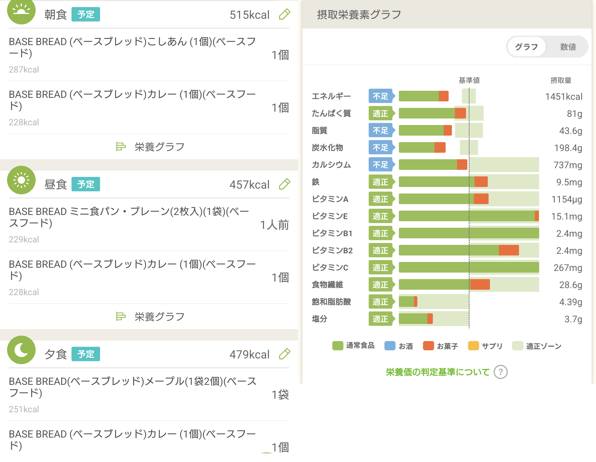
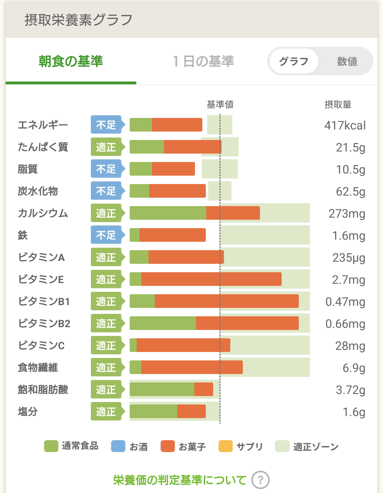
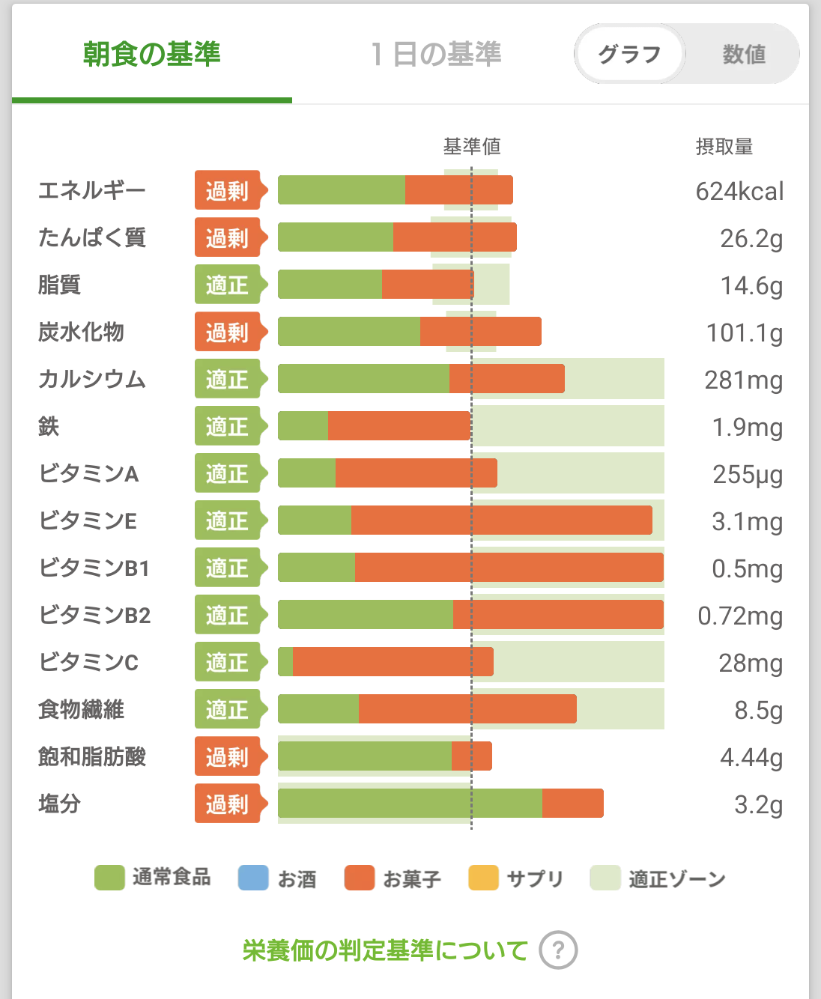

# ベースブレッドを使って、忙しい朝も、ご飯を食べる

はじめましての方ははじめまして　ご存知の方はそうだよヒズミさんだよ。（いや、9割はじめましてだろうが）

食と睡眠は健康の秘訣です。
メンタルにもかかわってきます。
３食バランス良く食べましょう・・・そう言われても、一人暮らしでは難しい！
在宅がメインの僕は、始業ギリまで寝てしまうので、無理です（それはただの怠惰）

朝は時間がありませんね。会社に遅刻もできません。前日に作り置きなどできるスキルがあれば良いのでしょうが、これを読んでいるということはありませんね？
丁寧な生活をなんてできるわけもありません。
それでも、人生は長い。健康でいたいものです。（苦痛とともに人生を送るのはつらいものです）
そのためには、栄養バランスの取れた食事を心がけたいものです。
ま、無理なんですけどね。

無理と切り捨てては、その時点でこの章は終わってしまいます。
それではこの本を手に取ってもらったのに失礼ですね。
浮いた話が一つもない独身の一人暮らしでも簡単に用意できるもの・・・
継続は力なりだよ兄貴！意識高そうにふんぞり返る前に、続けるための手立てを！
継続するためには、そう、完全食です。

一日の3分の1の栄養素が摂取でき、パンなら電車待ちでも電車の中でも食えます。（周りに気を付けて）
昔は公式から頼む以外では手に入りませんでしたが、今ではコンビニでも買えます。
一食600円(二袋)くらいで、高いのは間違いない・・・でも、スパチャか課金しか使い道がないのでしょう？？
30日で18000円。一回、み●ち若しくはぺ●らに、赤スパ投げるのやめましょう。
いや・・・ね●ちか？？？？

## 3食 ベースブレッドにすると、どうなるのか

言うだけなら簡単だよね。と思ったので、栄養管理アプリ『あすけん』におせわになりました。
結果としては、エネルギー・脂質・炭水化物が足りてない。
外食するとさくっと過剰摂取になる脂質が足りてません。

{width=100%}

そもそも、食物繊維が結構多くてもちもちの食感で、一袋だけでお腹にたまりますから、キツいものがある。
プレーン位しかなかった頃に、３食置き換えようとしたけど、食の優先度が低い方じゃないと、あれは拷問です。ジュネーブ条約違反ですよ。なんで、腹に重いパンを二つも食わないといけないのか。

## ここで、プランBです。

二つ食べるのは難しいとして、他の物と組み合わせて、栄養バランスを取りましょう。
（二つ食えるなら、加えて、カップめんを食べれば、補えそう。）

{width=50%}

こうして可視化すると、追加で何を食べればいいのかの目安になって良いですね。
ビタミンAを除いて、ビタミンは取れていますね。

鉄・カルシウム・炭水化物・資質・タンパク質・カロリー・・・何を摂ればばいいか調べてもいいし、自分が食べたことがあるものを入力してどうなるかを試してみるのもいいと思います。

ちょうど、あすけんでキャンペーンをしていたクノールの「タンパク質が取れるコーンスープ」を買っているので、入れてみます。

{width=50%}

摂取基準に近づきましたね。

他の足りない部分を、食べたいもので埋めてみましょう。
ということで、セブンイレブンのおにぎり「たまご醤油」を入れてみます。

{width=50%}

不足値が逆に超えましたね・・・***帯に短し、たすきに長し***とはこのことをいうのでしょうか。

## まとめ

忙しいなら、ベースブレッドなどの完全食で、補おう。

しかし、ベースブレッドを二つも食うのは難しいので、そこは別のもので何を食べるか。
困ったなら、あすけんを元に考えてもいいかもしれない。

逆にいつもの食生活に、ベースブレッドを足してみてどうなるか。見てみるのも楽しいかもしれません。

ただ、毎日あすけんとにらめっこというのも、楽しくないので、困ったときにどうぞ。