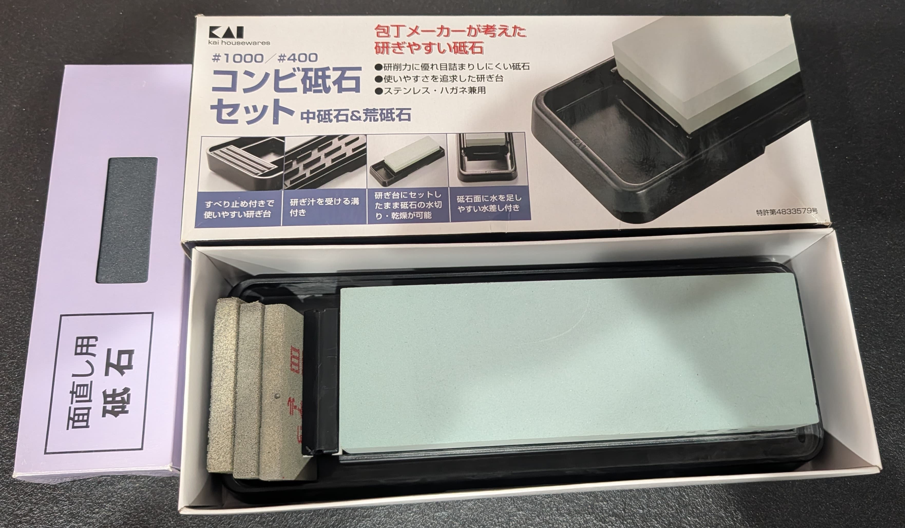
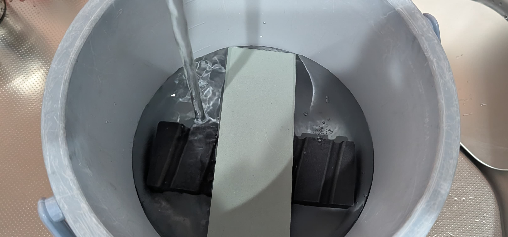
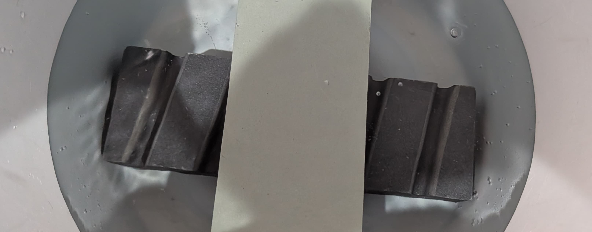
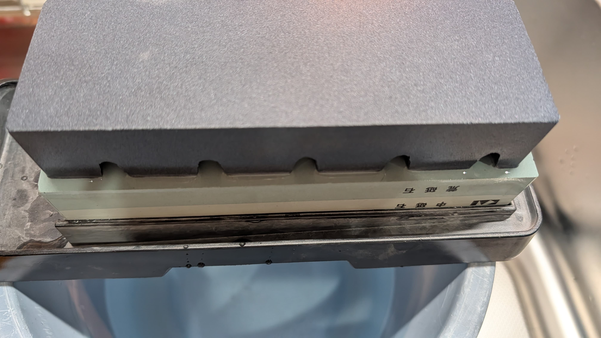
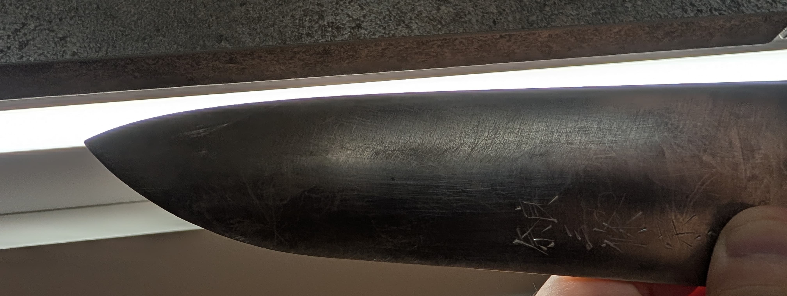
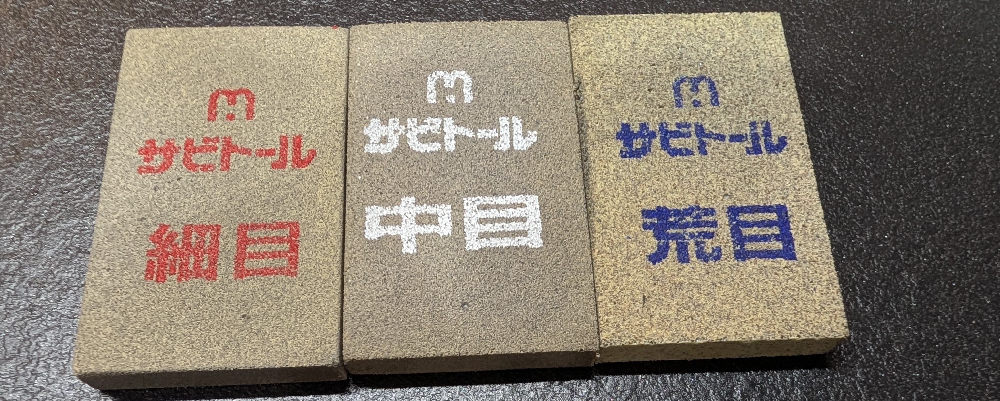
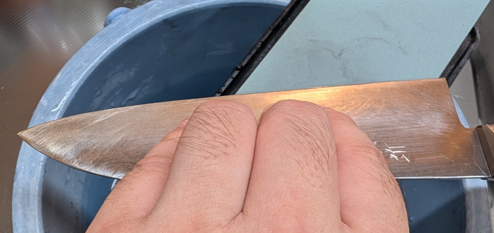
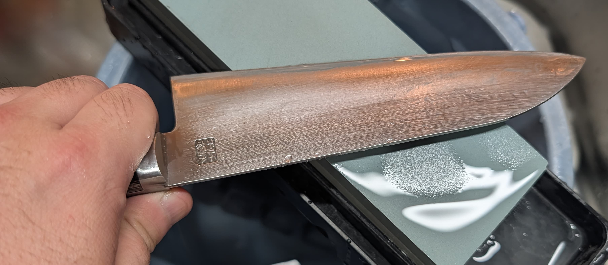
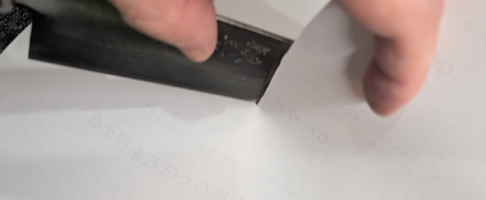
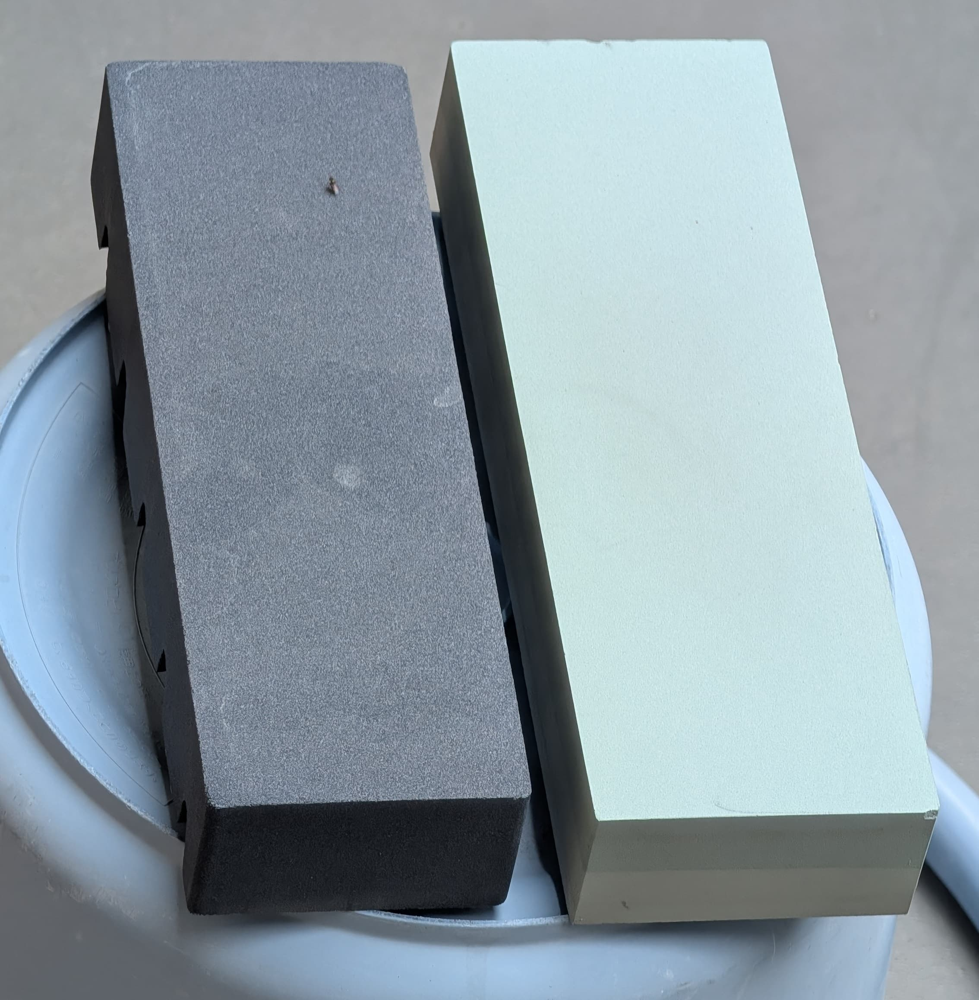

# 包丁をとごう

包丁の切れ味がわるくなったら研ぎましょう。
なお必要なものがそろってさえいればそこまで難しくはありません（簡単なわけでもないのだが）

## 必要なもの

家にあるものでいうと次の通りです。

| 買ったもの | おねだん | 正式名称 |
| ---- | ---- | ---- | ---- |
| 砥石 | ￥2,145_ | 貝印 KAI コンビ砥石セット (#400・#1000) 日本製 AP0305 |
| 面直し砥石 | ￥2,950_ | 貝印 KAI 面直し用砥石 日本製 093AP2475 |
| バケツ | 不明 | 5リッターぐらい入るやつ ※砥石と面直し砥石が入るサイズのものを用意 |
| サビトール | ￥680_ | 中京研磨 サビトール 65x40x9 |

※注１:おねだんは執筆時点(2025/08)のamazon実売価格ベースです 
※注２:仕上げ砥石は不要と判断し買ってません。

{width=60%}

## 研ぐ手順

まずは水をバケツに張って、砥石と面直し砥石をしっかり(最低15分)浸水させます。

{width=60%}

浸水していくと、最初は泡が出ます。泡が出なくなるまではひたすら浸水します。別に15分と言わず、1時間ぐらい浸水しても大丈夫です。別に15分以上でも問題はないので私の場合は数時間ほっとくケースが多いです。

{width=60%}

砥石の浸水が終わったら砥石を置き、面直し砥石で砥石の面をフラットにします。これで砥石側の準備は完了です。

{width=60%}

包丁の欠けをまずは確認します。包丁の刃の部分を光にかざすことで、刃の部分の欠けが見やすくなります。ぜひ見ておきましょう。

{width=60%}

またサビ等がある場合は、事前にサビを取っておきましょう。これには「サビトール」という包丁用の砂消しゴムが売られており、これを使うのが楽です。サビのところをを荒目から順番にこすっていくとサビが取れます。 
※今回はステンレス刃の包丁だったのでサビている箇所はなくステンレス刃だとサビる事はほぼないですが、鋼の包丁だとすぐサビがちです、実際の作業画像は割愛してます。

{width=60%}

面直し砥石で研がれてフラットになった砥石に対し、包丁を常に同じ角度になるよう斜めに当てて、ひたすら同じ角度で研ぎ続けます。

{width=60%}

なお、並行にちゃんと力を入れたほうが良く研げます。

{width=60%}

包丁の片側が研げると、刃の先が逆側にひっくりかえる、いわゆる「反り返り」という現象が起きます（手で直接触ると鋭利な棘が刺さる事があるので注意）。そうしたら逆側からも同様に研ぎます（逆側は刃を整えるだけなので半分ぐらいの回数で良い）。

{width=60%}

研ぐ画像は粗砥石でまず粗研ぎで研いでいますが、このあと中研ぎ砥石でも同様に両側を研ぎます。 
もし仕上げ砥石があるなら、これでも同様に両側を研ぎましょう。それらの研ぎが終われば、研ぎは完成しているはずです。

最後に確認のため紙を切ってみたりして、ひっかかりがない事や、刃に紙の繊維がつかない事を確認したら包丁研ぎが終わり、包丁が綺麗に研げている事がわかります。 
※なお、画像ではコピー用紙を使っていますが、新聞紙などでも良いです。

{width=60%}

後片付けも、砥石を面直し砥石で改めてフラットにしておき、その後砥石を乾かせば終了です（1日ぐらい外干ししましょう）。

{width=60%}

## おわりに

包丁を軽率に研げると、刺し身など包丁の切れ味がダイレクトに効いてくる料理が軒並みおいしくなります。
ぜひ、包丁を研ぐ「技術」、身につけておきましょう！
