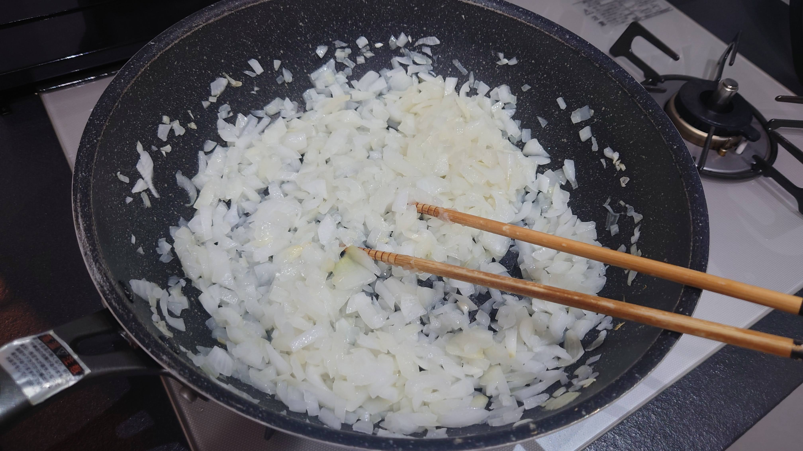
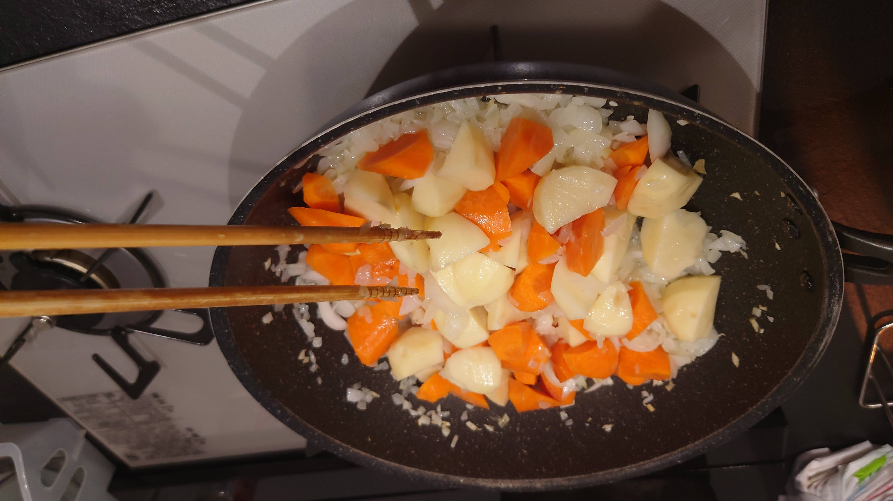
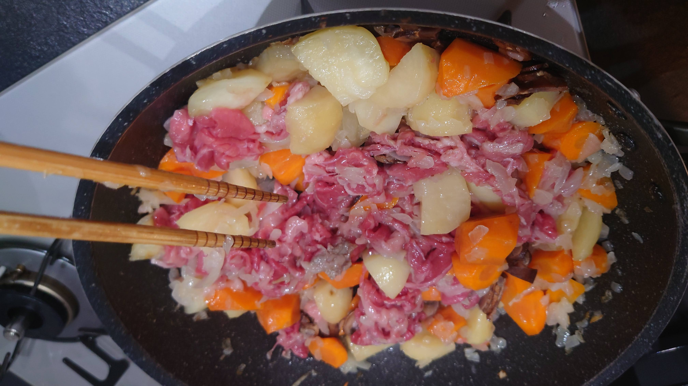
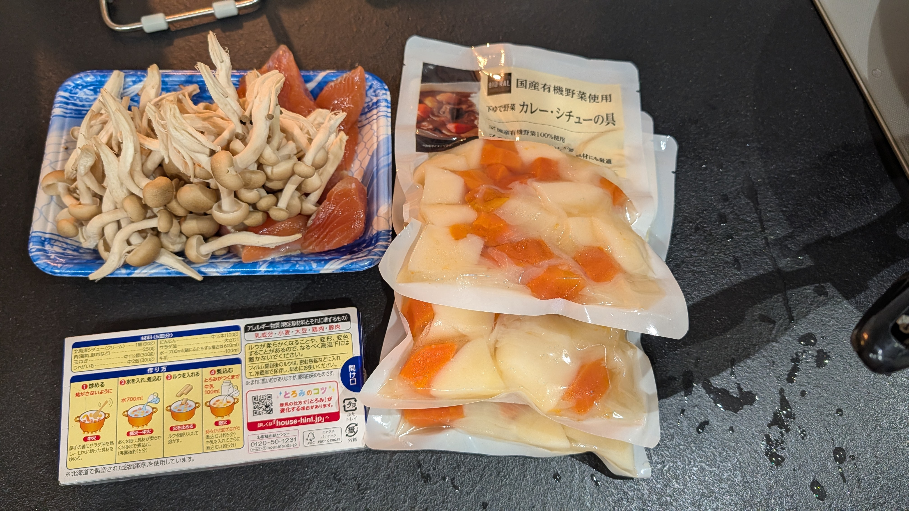
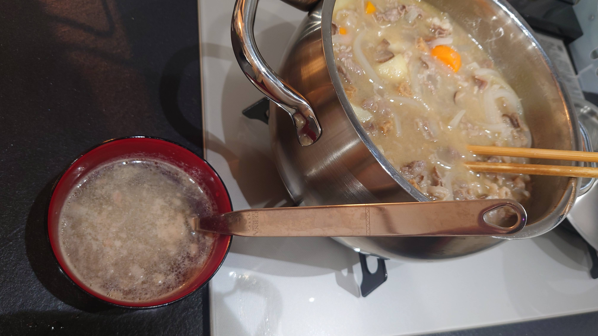
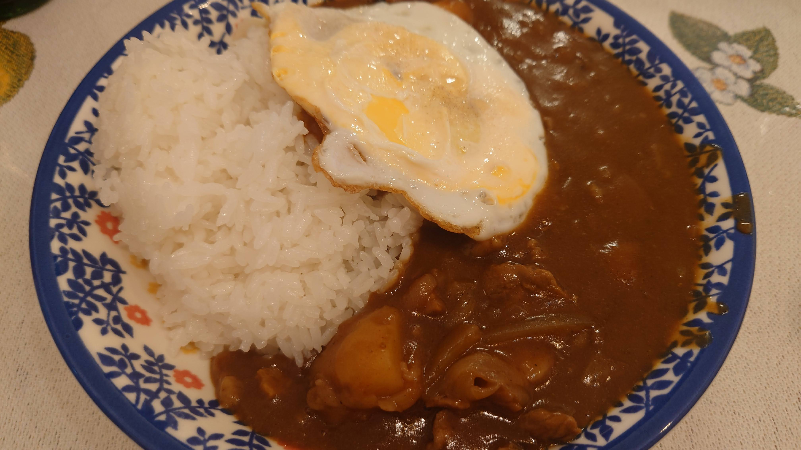

# 丁寧にカレーをつくろう

カレーを作りたくなった時に役立つ、丁寧なカレー作成の手順を学んでいきましょう。

## 前提として

カレーを作る時に狙いたいポイントとしては、**根菜によく火を通す(一般的には焼く)**点が挙げられます。

必要な具材はおおまかには次の通り。それぞれの必要量はルゥの記載を参考にしましょう。

| 具材 | 必要度 | 備考 |
| ---- | ---- | ---- |
| たまねぎ | ★★★ | 旨味を決める要素 |
| 肉 | ★★★ | 関西だと牛肉、関東だと豚肉が主流です。鶏肉でも良いでしょう。 |
| じゃがいも | ★★★ | 根菜代表１、よく焼きたい |
| にんじん | ★★★ | 根菜代表２、よく焼きたい |
| 冷凍たまねぎペースト | ★★ | 時短をしたいのであれば導入すると一気に楽に(ただし入れすぎると甘くなる) |
| きのこ類 | ★★ | 王道はマッシュルームかエリンギなどです |
| ルゥ | ★★★ | 後述しますが固形ルウと顆粒ルウがあります。両方あるとすごい楽 |
| コンソメ | ★ | 味調整要員 |
| 粉末カレー粉 | ★ | 味調整要員(あれば) |
| しお | ★ | 味調整要員 |
| ウスターソース | ★ | 味調整要員 |
| トマトジュース | ★ | 味調整要員 |

## 手順

カレーはおおまかに次の手順で作ります。
調理は鍋１つでやってもよいですし、炒める工程はフライパンでやって、その後に鍋を使っても良いでしょう（筆者はフライパンの方が炒めやすいのでフライパンと鍋を両方使う派です）。

### 炒め玉ねぎを自分で作る場合は刻んでよく焼く

炒め玉ねぎを自分で作る場合は、みじん切りにしてフライパンでよく焼きます。
色が変わるぐらいまで焼かないと硫化アリルが分解しない（辛さが抜けない）ので、結構長期戦です。最低でも２０分ぐらいかかります。

### 肉を焼く

まずは肉をほどよい大きさにカットし、その後フライパンに入れ、焼きます。肉の脂を野菜に絡めて焼くのが目的です。

### 根菜（じゃがいも・にんじん）を焼く

乱切りした根菜をフライパンに入れ、焼いていきます。しっかりと生っぽい色ではなくなるまで焼くと、表面の水分が飛び、崩れにくくなります。
なお、きのこ類も崩れる事はないのでこのタイミングで入れて焼いても構いません。
２０分ぐらい普段は炒めてます（この時間が適切なのかはよくわからない）。

なおこんな事を書いていますが、撮った写真をみてみると野菜から焼いていましたね……　はて……（結局火が通って両方炒められていればよいといえばよい）

カレー用の野菜水煮

カレー用の野菜水煮を使うと時短できます。
ただし、野菜水煮はどうしても野菜の旨味が多少失われた状態になっているので、野菜の味がものたりなくなるようです。そしてコスパも悪い……（妻から不評でした）

### 具材としてのたまねぎを焼く(欲しければ)

ある程度の大きさにカットした玉ねぎをフライパンに入れ、焼いていきます。こちらは具材としてなのである程度火が通っていればよいでしょう。

### 焼けたら鍋に移して水を規定量入れて煮る

焼けたら規定量の水を入れて煮ましょう

### 煮立ってきたらアクが出るのですくいとる

肉を煮るとアクが出ます。すくいましょう。
何度かすくってるとアクは出なくなります。

アクをすくいながら規定時間煮ます。
なお煮る時の撹拌はお玉が使われがちですが、菜箸のほうが楽な事もあります。
ルゥにレシピが大抵書いてありますが、概ね２０分ほど煮ます

### 炒め玉ねぎを冷凍やチューブで対応する場合はこのタイミングで入れる

冷凍などの炒め玉ねぎは普通に煮ると浮いてくるので、アクをすくいきってから入れましょう。
そのほうが無駄になりません。

なお炒め玉ねぎは冷凍じゃなくチューブタイプのものもありますが、業務系のスーパーで冷凍のものをかってきて小分けにして使うのが一番安上がりです。

オニオンソテーダイス３０と５０と７０

炒め玉ねぎを作ると甘く美味しくなることは事実なのですが、あまりに面倒……　な人のために「オニオンソテーダイス」というものが売られています。

これは玉ねぎを刻んであらかじめ炒めたものを冷凍しているものなのですが、オニオンソテーダイスには３０と５０と７０があります。

この数値は、元のオニオンダイス（タマネギみじん切り）をソテーして、元の重量の何％になっているかを示しているそうです（なので７０より５０，５０より３０のがすこし高い といってもそんな劇的に高くはないが）。

時短のために買うのであれば、３０を買いましょう。

参考： https://www.jfda.co.jp/product/detail1297.html

### 火を止め、ルゥを入れる

**火を止めて**ルゥを入れます。この際、固形ルウと顆粒ルウがある場合は、固形ルウを入れて溶け切った事を確認してから顆粒ルウを入れる事になります。

なお、顆粒ルゥはコスパだけでいうと業務スーパーに売っている、ハチ食品の「カレー専門店のカレールー」が最強です。

参考： https://www.hachi-shokuhin.co.jp/products/prd300251/

### 味を見て調整する

ここからは味を調整していきます。

まず、ルゥの濃度が足りないときにもし顆粒ルウがあれば、まずは顆粒ルゥを足して味を見ていきます。

濃度が決まったが、その後うまみが足りなければコンソメ（もしくはトマトジュース）、スパイスが足りなければカレーパウダー（もしくはウスターソース）、塩辛さがたりなければ塩を入れて味を調整していきましょう。

我が家だと、あると便利なカレーパウダーはハウス食品のものを使っています。

https://www.h-spice.jp/dictionary/cd_085423.html

味が決まったあと５分ほど煮込めば完成です。

## おわりに

ぜひカレーの作り方を覚えておいて、急なインド人の襲撃が発生しても、スマートに対応できるようにしておきましょう。
