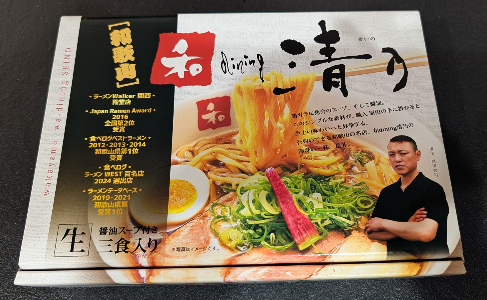
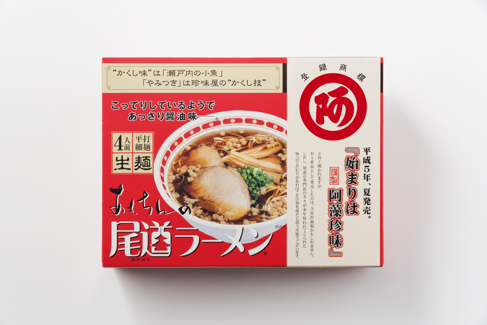
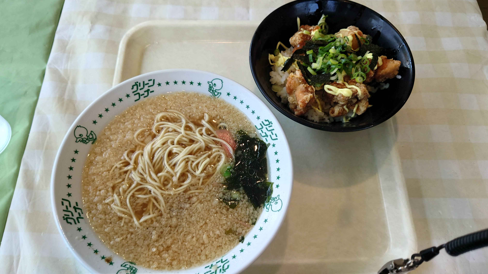

# 旅行先で得られる「食」の世界

今回は、旅行先で得られる「食」について、「お土産ラーメン」「現地スーパー」の観点から考えてみましょう。

## お土産ラーメンの世界

全国各地にはそれぞれ特色のあるラーメン屋があります。

すると、それをお土産としてパッケージ化したお土産ラーメンがあります。

知らない人も多いかもしれませんが、最近のお土産ラーメンはだいたいうまいです（今は全国でお土産ラーメンだけを専門に作る業者さんもいくつかあるようなので、味が総じて担保されがちなようです。専門業者さんでいうと、例えばアイランド食品さんなどが代表的です）

参考： https://www.island-foods.co.jp/

### お土産ラーメンのメリ・デメ

お土産ラーメンのメリットは

* 持って帰って楽しめる
* 繁盛店などだと並ぶ事もままあるが、お土産だと並ばずに買って帰れるので、旅行時の時間的な制約が少なくなる

なおデメリットは

* 店にちゃんと行かないと本来、店が出してるラーメンとどれぐらい違うのかがわからない
* 作るのがちょっと面倒かもしれない

などがあげられます。

なお、一般的なお土産ラーメンはベースとなる店があり、その再現を試みている物が多いですが、そうじゃないのも多少あります。

### お土産ラーメンの特殊例

お土産や持ち帰りタイプのラーメンとして、特殊な例を2つほど紹介します。

まずは**ベースとなる有名店がない状態で、お土産ラーメンがうますぎてラーメンブームが爆誕した**パターンです。

これは例えば、広島県尾道市の阿藻珍味さんの「あもちんの尾道ラーメン」です。

参考： https://amochinmi.co.jp/products/984/

今では全国的にも知られるようになった尾道ラーメンですが、もともとは非常にマイナーな地元のラーメンで、阿藻珍味さんがお土産として売り出したところそこから火がつき、尾道ラーメンブームが発生したそうです。

もう一つは、**ベースとなる店が他の業者を挟まず、自前でそのまま素直に出してる**パターンです。

これは例えば、和歌山市にあるお茶の玉林園さんが「グリーンコーナー」という店舗を出しているのですが、ここで食べられる天かす入りラーメンです。

参考： http://gyokurin-en.co.jp/rahmen.html

和歌山市近郊のスーパーだと、普通に持ち帰り用としてこの「てんかけラーメン」が売られています。

## 地元スーパーを漁れ　そこに現地の「食」がある

地元スーパーは地元の人が消費する「食」の宝庫であり、例えば同じ会社の、同じ銘柄・名前の商品であっても、地域によっては味付けやそもそもの味自体がガラッと違う事があります。

また、輸送にはそもそもコストがかかるものですし、地産地消の観点からもその地域でしか消費されないような「食」というのは思った以上に存在します。

このため、普段と違う地域を訪れた際は、それぞれの地域の地元で覇権を取っているスーパーに行ってみるとその地域ならではの「食」を得られる可能性が高くなります（漁協や農協がやっている直売所でも良いのですが、すこし観光客向けに半歩寄せた内容となっているケースが多く、地域独自の食文化を触れるという観点からは少し物足りないかもしれません）。

### 地域の「食」の売れ筋を知るには？

その地域ならではの食の情報を得るためには、まずはネットで調べましょう。だいたい生の声はネットに落ちています。

また店舗設計の基礎的な話にはなるので、知っている人も多いかもしれませんが**床から約75cm～135cmに陳列する商品が一番手に取られやすいゾーン**となっており、これを販売管理的な用語として「ゴールデンゾーン」や「ゴールデンライン」と呼びます。

この「ゴールデンゾーン」にある商品で、かつ地域性の高い商品は、その地域での間違いなく売れ筋と言えるでしょう。どれを買うかを迷ったら店舗内の配置にも目を向けてみてください。

## おわりに

この記事は旅行先で得られる「食」の世界についてお伝えしました。ぜひ旅行先での「食」の世界をひもといてください！
