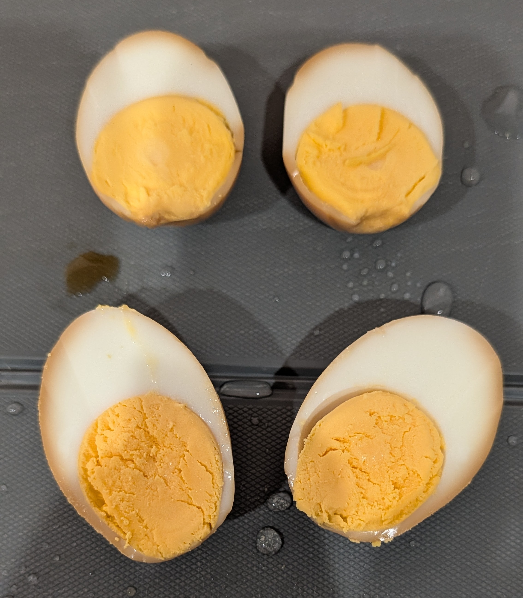
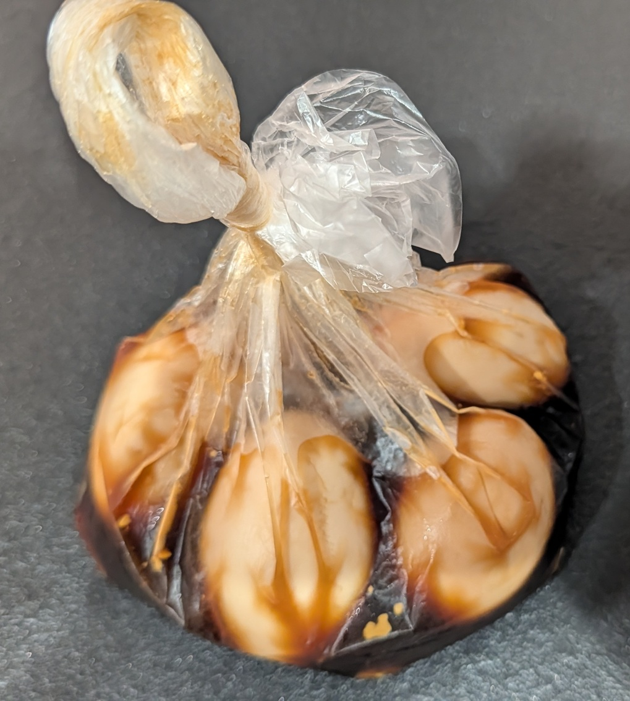

# あじたまをつくろう

あじたまを作れると家ラーメン（家ラー）が豪華になります。

作りましょう。

## まずはゆでたまごをつくれ

卵を１３分ゆでると固ゆでのゆで卵ができます（固ゆでにしたくない場合は、それまでの時間で止めます）。

まあそれだけでいいっちゃいいのですが、色々とコツがありますのでポイントを順に追っていきましょう。

### 鍋に水を張ってから直接卵を入れるな

タイトルの通りです。というのも卵の比重は結構重いし、鍋などの硬いものを当たるとすぐ往々にヒビがはいったり割れます。

もし水を張った後に卵を入れたい場合は、お玉に卵をのせて、できるだけ勢いがつかないように卵を鍋底に丁寧に置くようにしましょう。

### 水が沸騰しだしたら卵を６～７分はかきまぜろ

卵は黄身と白身が固まる温度や必要時間に違いがあり、普通に熱湯の中に卵をいれて湯がいた場合、白身は６分ぐらいから少しずつ固まりはじめます。そのため、白身が固まるまでは卵を軽くかき混ぜ続けないと、黄身の位置が偏ってしまうため中心がずれた卵になります（これはゆで卵としてもあまり嬉しくないですが、味玉にする場合はより嬉しくない事になります）

ゆで卵を信じてしっかり混ぜてください。

### 卵を１３分茹でたら速攻冷やせ

卵を１３分以上茹でたら、鍋ごと蛇口の下に移動させ、一気に流水で冷やします。
これは卵を持ちやすく(剝きやすく)するように　という意味合いもありますが、卵を冷やすことで卵のカラから身がはがれやすくなります。

## あじたまの漬け液をつくって漬けよう

簡単なつくりかたは以下の通りです

* 砂糖小さじ1
* 醤油小さじ4
* 水小さじ3
* みりん小さじ2
* ゆで卵2個

引用元： https://www.sirogohan.com/recipe/nitamago/

調味料３つと水を混ぜたらつけダレは完成で、これを密封できるタイプのしっかりした袋にいれておき、カラをむいたゆで卵を漬け込みます。

一晩ぐらい寝かせれば十分でしょう。冷蔵庫に入れてほっときましょう。

## あじたまができたぞ

これで家ラーが捗りますね！

## おわりに

この記事ではゆで卵と味玉についてでした。

味玉を生成できるようになって、家ラーを充実させてみてください！
