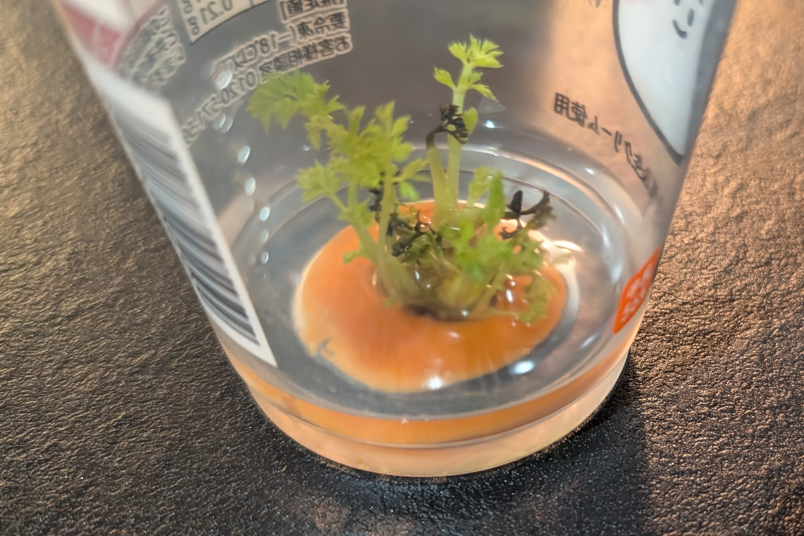
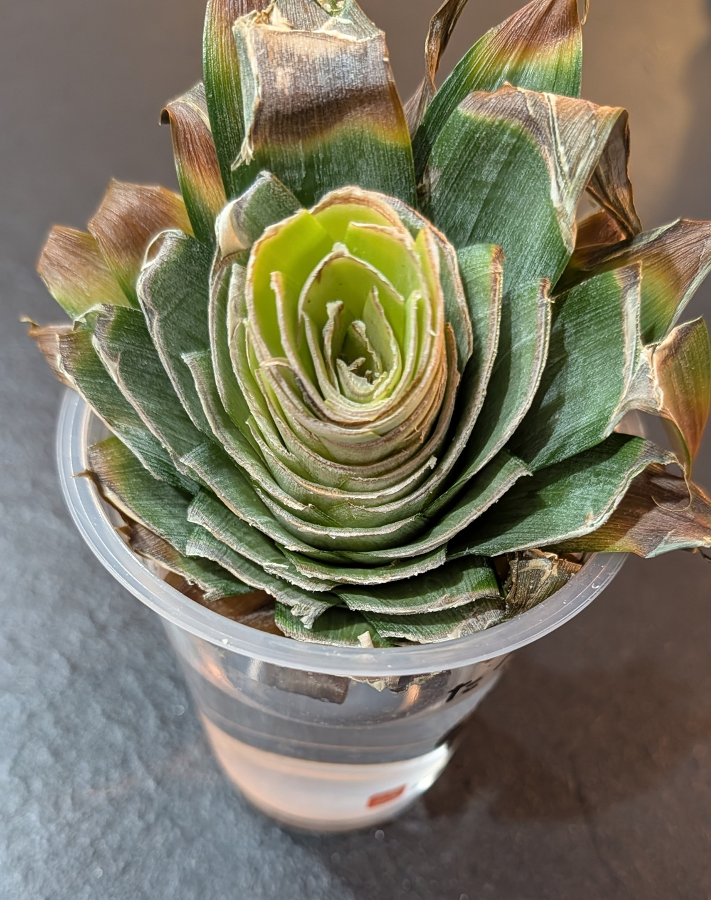
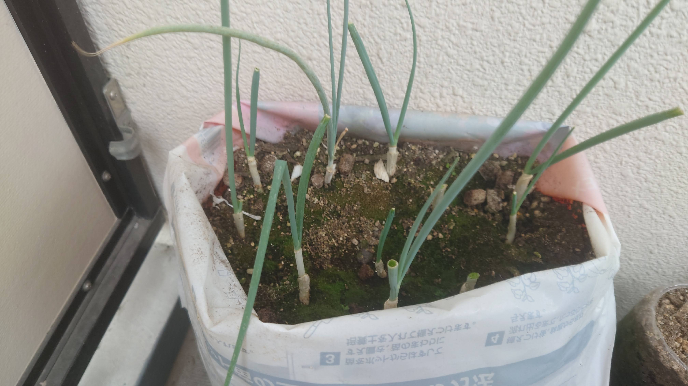
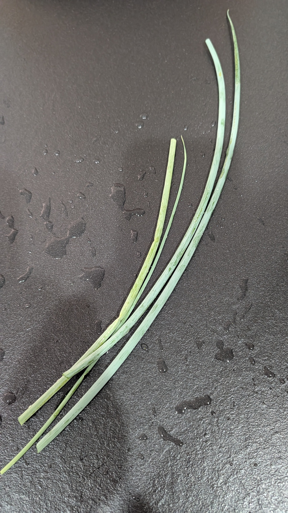

# 無限にネギがでてくるシステム「リボネギ」

ネギ、たまに無性に欲しい時がありませんか。

根付きネギをカットして根を水耕栽培で少し伸ばし、その後腐葉土に差しておくと、うまく定着すると無限にネギが食えます。知ってましたか？

この無限ネギシステム、通称「リボネギ」について今回はご紹介します。

## リボネギの前提となるリボベジについて

リボベジという、野菜クズをつかったリサイクル水耕栽培があります。

これは、野菜くずで芽が出そうなところを水につけておくと、芽が出るのを楽しむ　という水耕栽培法です。

これをネギで行うのがリボネギになります。ただしネギを継続的に得るには1つだけ大事なコツがあります。

それは農協などの直売所で**根がついたままののネギ**を入手する事です。

あと、植える先としての腐葉土などの土を入手しておきましょう（これはネギを水耕栽培して根が伸びだしたのを確認してからでも良い）。

## ネギは家で採れる

実際に水耕栽培で根が伸びたことを確認し、腐葉土袋に植えた例が次のような形になります。

新鮮なネギをぜひ得て下さい。新鮮なネギは薬味としてさいつよです。

## おわりに

この記事はネギを無限に収穫できるシステム「リボネギ」についてご紹介しました。

ぜひリボネギで新鮮な薬味を無限に得られる生活を実現してみてください！
