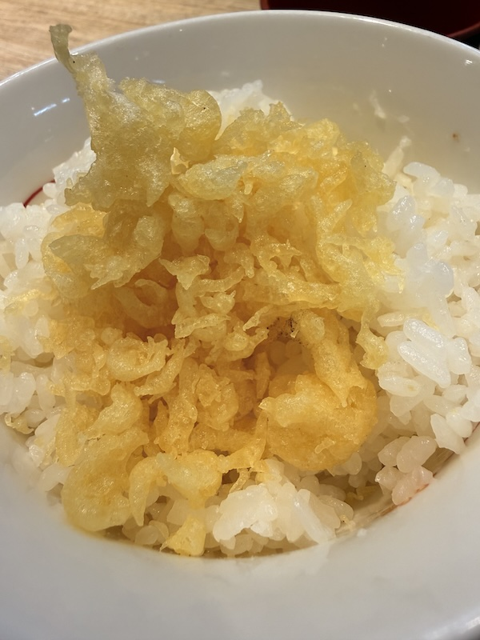
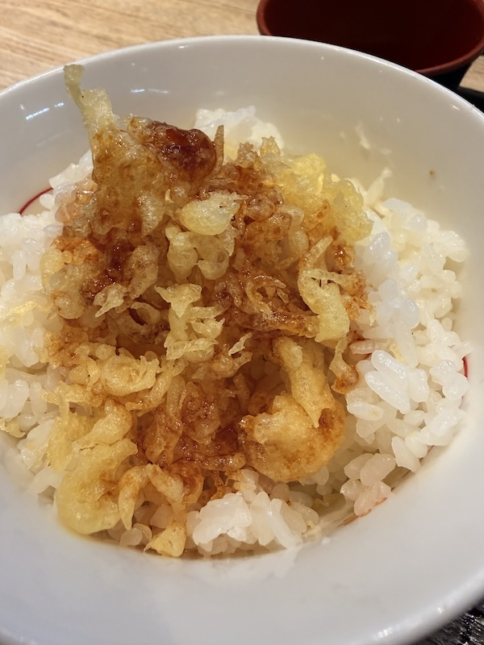
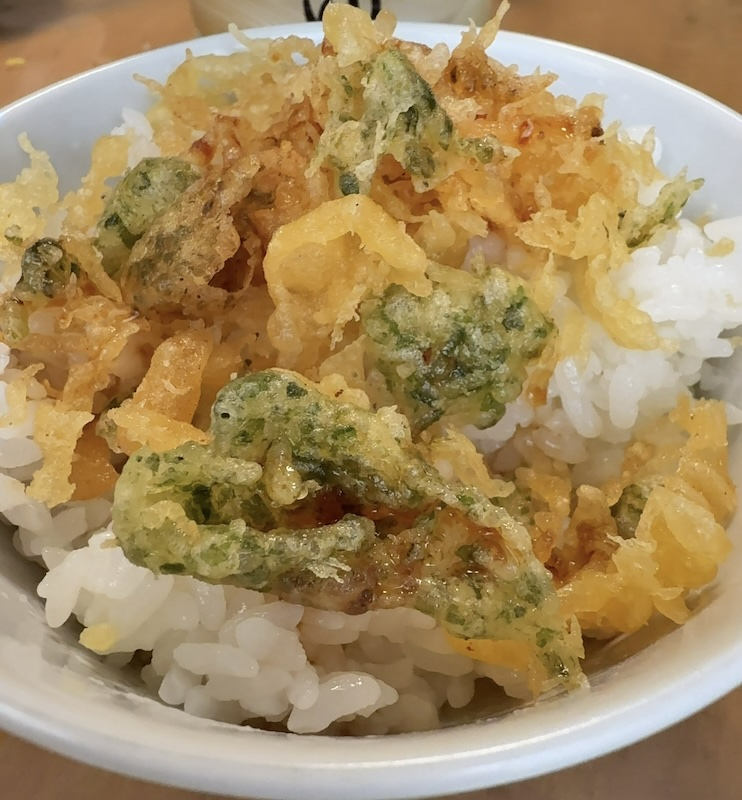
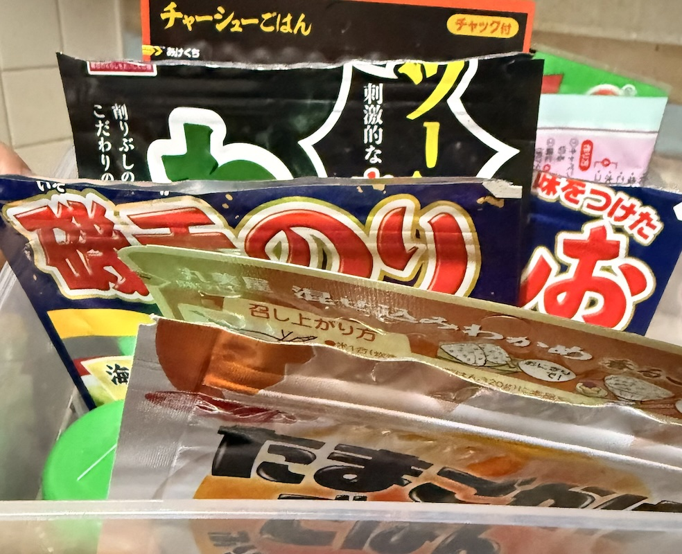

# 究極のチープ飯！マーガリン醤油飯と揚げ玉ご飯の魅力

さっぴー川原 @sapi_kawahara

この二大チープ飯に共通するのは、「手軽さ」「安価さ」「満足感」という三拍子です。

最大の魅力は、調理時間が実質ゼロであること。ご飯さえあれば、あとは手元にある調味料や常備品をかけるだけで、瞬時に一食が完成します。マーガリンも揚げ玉も極めて安価なため、食費の節約に直結します。

そして、どちらもシンプルながら、濃厚なコクや旨味、食感によって空腹を満たす高い満足度が得られるのが特長です。忙しい毎日の中で、時間や予算を気にせず、背徳的とも言える幸せを感じさせてくれる、日本の知恵が詰まった至高のソウルフードと言えるでしょう。

## 究極のチープ飯「マーガリン醤油ご飯」レシピ

マーガリン飯の真髄は、その素材のシンプルさにあります。

材料（1人前）

 - 炊きたてのご飯：お茶碗1杯分（約150g〜200g）
 - マーガリン（または食卓用スプレッド）：小さじ1杯程度
 - 醤油：数滴（お好みで調整）
 - （お好みで）うま味調味料（例：味の素®）：少々

{width=43%}

作り方

 1. ご飯を盛る: 茶碗にご飯をよそいます。熱々であることが重要です。
 2. マーガリンを乗せる: 炊きたての熱いご飯の中央に、冷たいマーガリンをポツンと乗せます。
 3. 味付け: マーガリンの上に、醤油を数滴、焦らすように垂らします。
 4. 混ぜる: すぐに全体を、マーガリンが溶けてご飯全体にツヤが出るまで手早く混ぜ合わせます。
 5. 完成: お好みでうま味調味料を振って、すぐにいただきます。

## 究極のチープ飯「マーガリン醤油ご飯」の魅力を語る

「マーガリン飯」が持つ **「チープさ」は、単なる安価な材料構成以上の、深い文化的・経済的背景を内包しています。このチープさは、「許容された妥協」と「切実な渇望の代用品」**の二面性から成り立っていると言えます。

1. 構成要素の象徴性：バターとの対比
この料理の根幹を成すのは「マーガリン」です。バターが「贅沢」「風味」「本物」の象徴であるのに対し、マーガリンは**「バターの代替品」**として誕生しました。

経済的制約の可視化: マーガリンは、戦後間もない食糧難の時代や、高度経済成長期においても家計を預かる人々にとって、バターという高価な油脂を購入する経済的余裕がない場合の **「甘いもの（コクや風味）への妥協」**の産物でした。マーガリン飯は、まさにその制約下で編み出された「ささやかな贅沢」であり、その「チープさ」は当時の生活水準を象徴しています。

「偽りの」豊かさ: バターに似た風味を低コストで実現したマーガリンは、本物ではないが故に安価であるという構造を持ちます。ご飯にマーガリンが溶け出す様子は、**「本物のバターライスのようなものを、この価格で得ている」という、背伸びした満足感、あるいは「見せかけの豊かさ」**を感じさせます。

2. 調理法と食感の「手抜き」感
レシピの作り方は、文字通り「混ぜるだけ」です。

極限の時短: 炒める工程（マーガリンライス）も存在しますが、もっともチープな形態は「乗せて混ぜる」だけ。これは、調理にかけられる時間や労力が極限まで削られた状態、つまり **「空腹を速やかに満たさなければならない」**という切実な状況を示唆しています。この非効率的とも言えるシンプルさが、手抜き、ひいてはチープさを際立たせます。

口当たりの異質さ: バターが持つ乳脂肪特有の「滑らかさ」や「コク」と異なり、マーガリン特有のやや人工的で強い風味や、口に残りやすい油感が、この料理の「チープさ」を口の中で具現化します。

3. 味覚の構成：醤油の「支配力」
この料理の味の骨格は「塩気（醤油）」と「油脂（マーガリン）」の単純な組み合わせです。

うま味の過剰依存: マーガリン自体の風味は控えめなため、味の輪郭をはっきりさせるのが醤油の役割です。醤油の強烈な塩気とうま味が、マーガリンの油脂感を包み込み、味覚の単調さを無理やり補っています。これは、凝った調味料や素材を揃えられない状況下で、もっとも強力な調味料である醤油に頼らざるを得なかった結果です。

結論：チープさの「肯定」
現代においてマーガリン飯が語られる時、その「チープさ」は単なるネガティブな意味合いだけではありません。

それは、**「経済的困難を乗り越えるための知恵」として、また、「あの頃の自分を懐かしむノスタルジー」の対象として再評価されています。本物のバターご飯が「贅沢」であるならば、マーガリン飯は「許された怠惰」「安価な慰め」**であり、その素朴で、どこか物足りないバランスこそが、多くの人にとっての「マーガリン飯の味」として記憶され続けているのです。この「チープさ」は、貧しさの中に見出したささやかな幸福の痕跡として、現代の食文化の中で独特な地位を占めていると言えるでしょう。

## 究極のチープ飯「マーガリン醤油ご飯」の背徳感について

背徳的と言われる理由

 - 高カロリー: マーガリンの油分とご飯の炭水化物の組み合わせは、栄養バランスを考えると決して模範的ではないかもしれませんが、それがまたたまらない美味しさを生み出します。
 - ジャンクな魅力: バターよりも比較的安価で手軽なマーガリンを使うことで、「最強の貧乏飯」「ジャンクな味」として愛される側面があり、そのB級グルメ的な魅力が背徳感を高めます。
 - バター醤油ご飯との比較: 似たレシピに「バター醤油ご飯」がありますが、マーガリンの持つ独特の風味や塩気が、よりガツンとした食べ応えを感じさせ、「やめられない止まらない」という感情を引き起こします。

それでも、私は妻に内緒で朝の忙しい時間帯に、こっそりとマーガリン飯を食べる行為には、特別な魅力があります。そのささやかな反抗心と、一日の活力となる満足感が、まさに「背徳的な食べ物」の真骨頂と言えるでしょう。

## 究極のチープ飯「揚げ玉ご飯」レシピ

醤油の香ばしさとだしの旨味で、揚げ玉の美味しさが引き立ちます。

【材料】（1人分）

 - 温かいごはん：お茶碗1杯
 - 揚げ玉（天かす）：大さじ1〜2
 - 醤油：小さじ1〜2（お好みで調整）
 - うま味調味料（味の素®）：3〜4ふり

{width=30%}
{width=30%}

【作り方】

 1. ご飯を盛る: 茶碗にご飯をよそいます。熱々であることが重要です。
 2. 揚げ玉を乗せる: 炊きたての熱いご飯の中央に、揚げ玉を乗せるをバラバラと乗せます。
 3. 味付け: 揚げ玉の上に、醤油を数滴、焦らすように垂らします。
 4. 混ぜる: すぐに全体を、揚げ玉が混ぜご飯のようになるよう混ぜます
 5. 完成: お好みでうま味調味料を振って、すぐにいただきます。

## 究極のチープ飯「揚げ玉ご飯」の魅力を語る

1. 揚げ玉の存在
主役である揚げ玉は、天ぷらを揚げた際にできる衣の破片であり、小麦粉と油が凝縮された **「旨味の塊」**に他なりません。 通常、天ぷら油には、海老や魚介、野菜などさまざまな具材の旨味が溶け出しています。この旨味をたっぷり吸い込んだ揚げ玉を熱々のご飯に混ぜることで、ご飯一粒一粒が、まるで本格的な天丼のタレをまとったかのような、芳醇なコクと風味を帯びるのです。

また、揚げ玉の魅力は味だけではありません。混ぜた直後のサクサクとした軽快な食感から、ご飯の蒸気と醤油の水分を吸い込み、じゅわっとした **「ふやけ食感」**へと変化していく過程も、この料理の醍醐味です。この食感の変化が、食べるたびに新たな喜びを与えてくれます。

2. シンプルな調味料が引き出す力
今回のレシピで用いたのは、醤油と**うま味調味料（味の素®）**という、日本の家庭に必ずあるシンプルな調味料です。また醤油の香ばしさと塩気は、揚げ玉の油分をキリッと引き締め、味全体に奥行きを与えます。油の重さを感じさせず、次の一口を誘う引き金となるのです。

うま味の相乗効果： 揚げ玉に含まれる動物性・植物性の天然の旨味成分に加え、うま味調味料を「ひとふり」することで、全体の旨味レベルが一気に引き上げられます。科学的に証明された「旨味の相乗効果」が働き、たったこれだけの材料にもかかわらず、まるで高級な出汁で炊いたかのような満足感を生み出すのです。

この「揚げ玉のコク＋醤油の香ばしさ＋増幅された旨味」という三位一体のバランスこそが、揚げ玉ご飯を「やみつき」にさせる最大の魅力です。

3. 圧倒的な手軽さという「価格の正義」
この美味しさが **「茶碗１つで5分以内に完成する」という手軽さと直結している点が、この料理の価値を不動のものにしています。とくに、一秒を争う朝の慌ただしい時間帯において、揚げ玉ご飯は単なる食事ではなく救世主**となります。

トーストを焼く時間、味噌汁を作る手間、ましてや卵を焼く余裕すらない朝。「何か食べたい、でも時間がない」という究極の二律背反を、揚げ玉ご飯は見事に解決してくれるのです。温かいご飯さえあれば、あとは調味料をぱらぱらと振りかけ、混ぜるだけ。このスピードと手軽さこそが、多忙な現代人にとって、揚げ玉ご飯が持つ抗いがたい魅力の1つです。

揚げ玉ご飯の主役である揚げ玉（天かす）は、その出自ゆえに驚異的な低価格を実現しています。スーパーマーケットで販売されている大袋でも、高くても100円（税込み）を優に下回る価格帯で手に入ることがほとんどです。一度購入すれば、数10回分の揚げ玉ご飯が作れる量を確保できます。

ご飯に混ぜ込む揚げ玉の量はごくわずかであり、醤油やうま味調味料のコストも無視できるレベルです。つまり、この料理は、一杯あたり数円のコストで、最高の旨味と満足感を提供します。食の喜びは、経済力に左右されるべきではないという、ある種の **「食の平等」**を体現しているのです。

経済的な公平性： 高級な食材や複雑な調理技術とは無縁の、誰もが、いつでも、どこでも再現できるという普遍的な正義。これは、家計に優しく、とくに経済的な制約がある状況下で、心を豊かに満たしてくれる「心の栄養剤」としての役割を担っています。

この「低コスト」と「高満足度」の圧倒的なギャップこそが、揚げ玉ご飯を単なる混ぜご飯ではなく、庶民の味方、食卓のヒーローたらしめているのです。

また、主役である揚げ玉（天かす）の魅力は、その品質によってさらなる深みを持つ。スーパーで安価に手に入る一般的な揚げ玉は、植物油で大量生産された「汎用的な旨味の塊」だ。これでも十分に美味しいが、天ぷら専門店から分けてもらう「高級揚げ玉」となると、話は別になる。是非体験してほしい。

{width=40%}

## 究極のチープ飯「揚げ玉ご飯」の背徳感について

1. 油とカロリーの誘惑
揚げ玉ご飯の魅力の源泉は、紛れもなく **「油」**です。サクサクの食感も、ご飯に染み込むコクも、すべては衣に含まれた油分によるものです。

我々は本能的に「油と塩分」の組み合わせを美味しいと感じるようにできていますが、同時に、現代社会では健康や体型維持のためにこれらを制限すべきという知識を持っています。つまり、揚げ玉ご飯は、この **「本能的な欲求」と「理性の制御」**との間で揺さぶりをかけてくる存在なのです。

まさに「健康への意識」から一時的に解放され、純粋な食欲に身を任せる儀式のように感じられます。一口食べれば、その濃厚な油の旨味が脳を直撃し、罪悪感は快感へと変わっていくのです。

2. 「ジャンクの王様」としての地位
揚げ玉ご飯は、しばしば「悪魔の〇〇」という異名で語られますが、これはその中毒性と簡単さ、そして抗いがたいカロリーの魅力を端的に示しています。まるで、健康的な食生活という規則正しい世界において、時折姿を現す **「ジャンクの王様」**のようです。

その存在は、常に「食べてはいけない」という理性の壁の向こう側にありますが、一度その壁を乗り越えれば、得られる満足感は計り知れません。揚げ玉ご飯を食べる行為は、日常の制約から解放され、自分自身を甘やかす **「究極の自己肯定」**の時間であるとも言えるでしょう。

揚げ玉ご飯は、日本の簡素な食文化の中で生まれた、最高のソウルフードの1つです。その最大の魅力は、旨味の凝縮された揚げ玉とシンプルな調味料が生み出す、圧倒的な美味しさと手軽さにあります。

そして同時に、その濃厚な油分と簡素な調理法がもたらす**「背徳感」**が、この料理をただのおにぎりや混ぜご飯ではない、特別な存在に押し上げています。

人は時として、理性を超えた快楽を求めます。揚げ玉ご飯は、その「食べてはいけない」という感情と、「食べたい」という本能的な欲求がもっとも美しく交錯する、まさに至高のジャンクフードであり、その二律背反の構造こそが、多くの人を惹きつけてやまない永遠の魅力なのです。

## 究極のチープ飯「悪魔の追いふりかけ」はいかが？

これだけでも美味しいのですが、ここに「悪魔の追いふりかけ」はいかがでしょうか？

味が馴染んだご飯の上に、「のりたま」を遠慮なくドバっと振りかける。そのまま、または軽く混ぜてかきこむ。

マーガリン、または揚げ玉の「じゅわっと感」と「のりたま」の「パラパラ感」の食感のコントラストも、やみつきになるポイントです。

いかがでしょうか。どのふりかけで、次のチープ飯を"悪魔化"させますか？

{width=30%}
