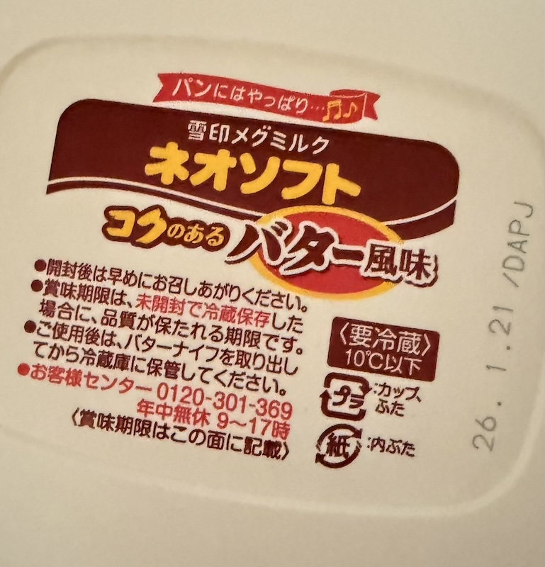

# 究極のチープ飯！マーガリン醤油飯と揚げ玉ご飯の魅力

この二大チープ飯に共通するのは、「手軽さ」「安価さ」「満足感」という三拍子です。

最大の魅力は、調理時間が実質ゼロであること。ご飯さえあれば、あとは手元にある調味料や常備品をかけるだけで、瞬時に一食が完成します。マーガリンも揚げ玉も極めて安価なため、食費の節約に直結します。

そして、どちらもシンプルながら、濃厚なコクや旨味、食感によって空腹を満たす高い満足度が得られるのが特長です。忙しい毎日の中で、時間や予算を気にせず、背徳的とも言える幸せを感じさせてくれる、日本の知恵が詰まった至高のソウルフードと言えるでしょう。

## 究極のチープ飯「マーガリン醤油ご飯」レシピ

マーガリン飯の真髄は、その素材のシンプルさにあります。

材料（1人前）

 - 炊きたてのご飯：お茶碗1杯分（約150g〜200g）
 - マーガリン（または食卓用スプレッド）：小さじ1杯程度
 - 醤油：数滴（お好みで調整）
 - （お好みで）うま味調味料（例：味の素）：少々

{width=40%}

作り方

 1. ご飯を盛る: 茶碗にご飯をよそいます。熱々であることが重要です。
 2. マーガリンを乗せる: 炊きたての熱いご飯の中央に、冷たいマーガリンをポツンと乗せます。
 3. 味付け: マーガリンの上に、醤油を数滴、焦らすように垂らします。
 4. 混ぜる: すぐに全体を、マーガリンが溶けてご飯全体にツヤが出るまで手早く混ぜ合わせます。
 5. 完成: お好みでうま味調味料を振って、すぐにいただきます。

## 究極のチープ飯「マーガリン醤油ご飯」の魅力を語る

「マーガリン飯」が持つ **「チープさ」は、単なる安価な材料構成以上の、深い文化的・経済的背景を内包しています。このチープさは、「許容された妥協」と「切実な渇望の代用品」**の二面性から成り立っていると言えます。

1. 構成要素の象徴性：バターとの対比
この料理の根幹を成すのは「マーガリン」です。バターが「贅沢」「風味」「本物」の象徴であるのに対し、マーガリンは**「バターの代替品」**として誕生しました。

経済的制約の可視化: マーガリンは、戦後間もない食糧難の時代や、高度経済成長期においても家計を預かる人々にとって、バターという高価な油脂を購入する経済的余裕がない場合の **「甘いもの（コクや風味）への妥協」**の産物でした。マーガリン飯は、まさにその制約下で編み出された「ささやかな贅沢」であり、その「チープさ」は当時の生活水準を象徴しています。

「偽りの」豊かさ: バターに似た風味を低コストで実現したマーガリンは、本物ではないが故に安価であるという構造を持ちます。ご飯にマーガリンが溶け出す様子は、**「本物のバターライスのようなものを、この価格で得ている」という、背伸びした満足感、あるいは「見せかけの豊かさ」**を感じさせます。

2. 調理法と食感の「手抜き」感
レシピの作り方は、文字通り「混ぜるだけ」です。

極限の時短: 炒める工程（マーガリンライス）も存在しますが、もっともチープな形態は「乗せて混ぜる」だけ。これは、調理にかけられる時間や労力が極限まで削られた状態、つまり **「空腹を速やかに満たさなければならない」**という切実な状況を示唆しています。この非効率的とも言えるシンプルさが、手抜き、ひいてはチープさを際立たせます。

口当たりの異質さ: バターが持つ乳脂肪特有の「滑らかさ」や「コク」と異なり、マーガリン特有のやや人工的で強い風味や、口に残りやすい油感が、この料理の「チープさ」を口の中で具現化します。

3. 味覚の構成：醤油の「支配力」
この料理の味の骨格は「塩気（醤油）」と「油脂（マーガリン）」の単純な組み合わせです。

うま味の過剰依存: マーガリン自体の風味は控えめなため、味の輪郭をはっきりさせるのが醤油の役割です。醤油の強烈な塩気とうま味が、マーガリンの油脂感を包み込み、味覚の単調さを無理やり補っています。これは、凝った調味料や素材を揃えられない状況下で、もっとも強力な調味料である醤油に頼らざるを得なかった結果です。

結論：チープさの「肯定」
現代においてマーガリン飯が語られる時、その「チープさ」は単なるネガティブな意味合いだけではありません。

それは、**「経済的困難を乗り越えるための知恵」として、また、「あの頃の自分を懐かしむノスタルジー」の対象として再評価されています。本物のバターご飯が「贅沢」であるならば、マーガリン飯は「許された怠惰」「安価な慰め」**であり、その素朴で、どこか物足りないバランスこそが、多くの人にとっての「マーガリン飯の味」として記憶され続けているのです。この「チープさ」は、貧しさの中に見出したささやかな幸福の痕跡として、現代の食文化の中で独特な地位を占めていると言えるでしょう。

## 究極のチープ飯「マーガリン醤油ご飯」の背徳感について

背徳的と言われる理由

 - 高カロリー: マーガリンの油分とご飯の炭水化物の組み合わせは、栄養バランスを考えると決して模範的ではないかもしれませんが、それがまたたまらない美味しさを生み出します。
 - ジャンクな魅力: バターよりも比較的安価で手軽なマーガリンを使うことで、「最強の貧乏飯」「ジャンクな味」として愛される側面があり、そのB級グルメ的な魅力が背徳感を高めます。
 - バター醤油ご飯との比較: 似たレシピに「バター醤油ご飯」がありますが、マーガリンの持つ独特の風味や塩気が、よりガツンとした食べ応えを感じさせ、「やめられない止まらない」という感情を引き起こします。

それでも、私は妻に内緒で朝の忙しい時間帯に、こっそりとマーガリン飯を食べる行為には、特別な魅力があります。そのささやかな反抗心と、一日の活力となる満足感が、まさに「背徳的な食べ物」の真骨頂と言えるでしょう。
