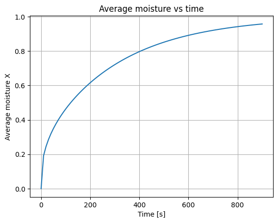
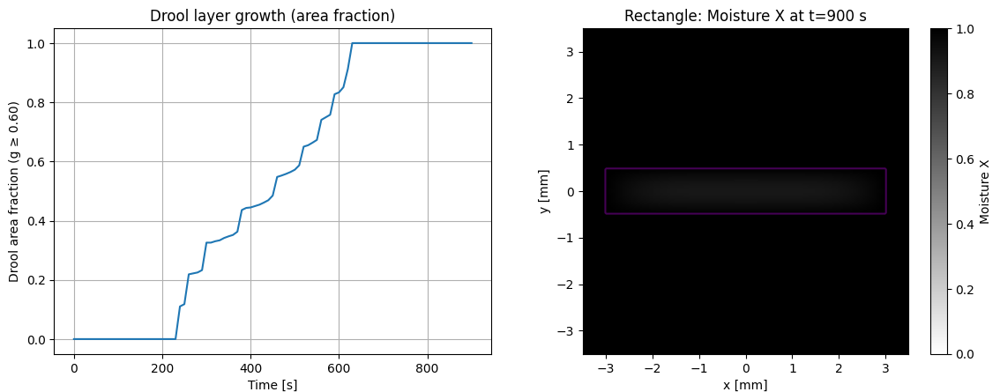
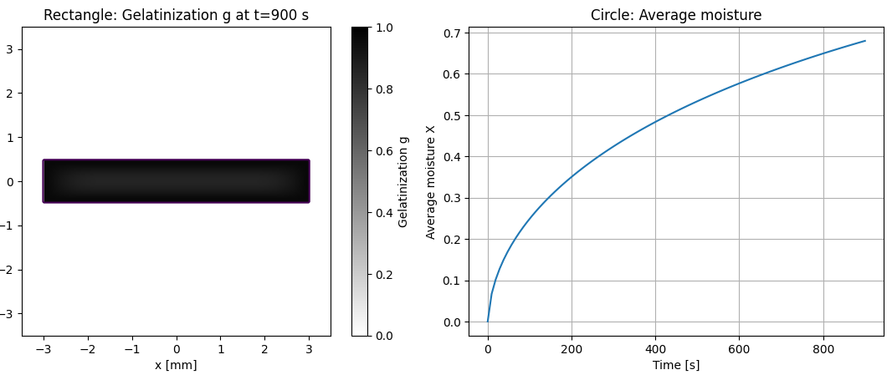
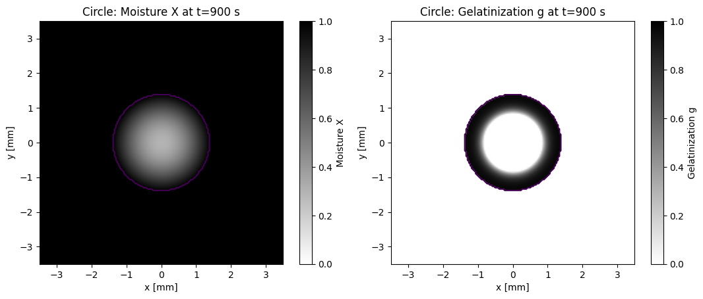
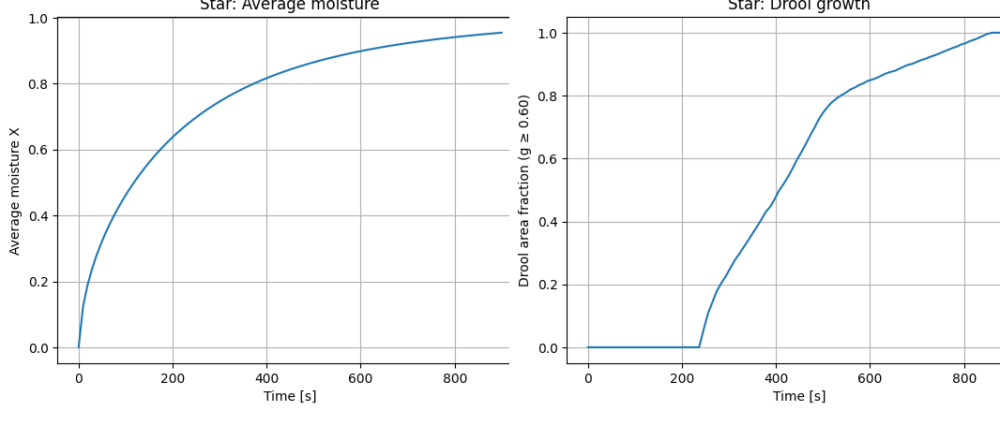
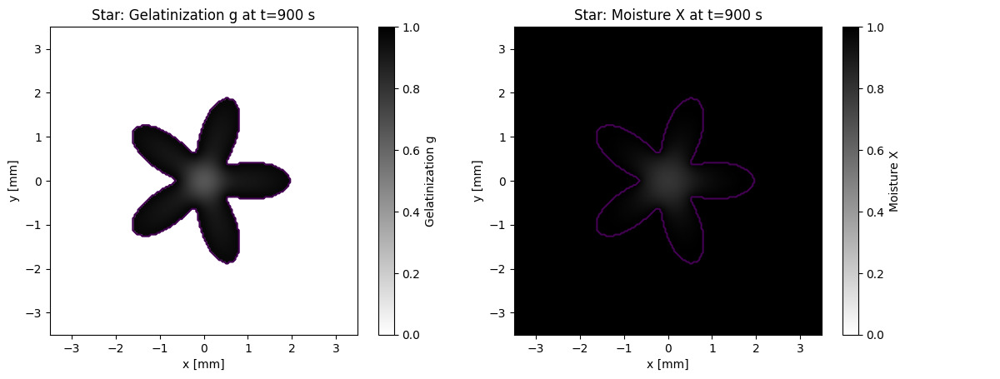

# パスタ断面形状が水の浸透とゼラチン化に与える影響

乾燥パスタをゆでるとき、ゆですぎると柔らかくなりすぎてしまいます。これはグルテンの網目構造が壊れてしまったゼラチン化状態に当たります。
ゼラチン化は、①十分な水があり②温度が高いときは早く進行します。このため、生パスタ風とするためにあらかじめ室温で十分に水を含ませる作業が行われます。

ゆで時間を最適化するには、このゼラチン化の進行を制御する必要があります。ゼラチン化は温度と水分に依存しますが、もう一つの重要な要因として「パスタの断面形状」が考えられます。例えば、穴あきパスタやらせん状のものなど、形状によって水の浸透経路が異なるはずです。そこで本稿では、断面形状が水の浸透とゼラチン化にどのような影響を与えるかを数値シミュレーションにより検討しました。

## シミュレーションモデルの概要
シミュレーションでは、パスタ断面を2次元の格子で表現し、水の浸透とゼラチン化の過程を数値的に解きます。以下のような仮定を置いてモデル化しました。

- パスタ断面は2次元の格子で表現し、各格子点での水分量とゼラチン化度を追跡する。<br>
（注）これは無限長のパスタ断面を仮定しており、実際の30 cm程度の長さによる端面効果は考慮していない。
- 水の浸透は拡散方程式でモデル化し、パスタの形状に応じた境界条件を設定する。

$$
\frac{\partial c}{\partial t} = D \nabla^2 c
$$

(注)ここで示す結果は、パラメータを仮設定して得られた定性的な挙動の一例です。物理的に正確な値を求める場合は、実験データなどを参照して調整してください。

- ゼラチン化は水分量に依存し、一定の水分量を超えた場合に進行する。沸騰温度のため反応は早く、水分量のみに依存するものとする。
- シミュレーションは時間発展を追い、一定時間ごとに水分量とゼラチン化度を記録する。

## シミュレーション結果

まず矩形断面（きし麺状）でシミュレーションを行い、基準として用いました。次に円形断面と花形断面を比較することで、形状効果を評価しました。

### 矩形断面の場合

{widwh=50%}

ゼラチン化したレイヤーの成長が階段状になっていますが、これは微分方程式を数値解法により求めたことが原因です。

900秒のゼラチン化の分布をみると、表面はゼラチン化してしまいベタベタしてしまう状態になっていることが分かります。一方内部にはわずかに芯が残っています。



矩形の他の形状として、円形と花形を試します。

### 円形断面の場合





900秒経過したときも円形では芯がかなり残っています。これでは表面はベタベタ、中心部は硬いという食感の差が大きくなってしまいます。



### 花形断面の場合



花形にすることで、芯はかなり軽減されました。

特に500秒過ぎからはゼラチン化が穏やかになり、中心部のゼラチン化が進んでいないことが分かります。



実行コード
```
import numpy as np
import matplotlib.pyplot as plt
import math
import pandas as pd
from PIL import Image

# 物理的定数の設定
D = 3e-10   # [m^2/s]
k_g = math.log(2)/180.0     # s^-1 (gelatinization half-time ~3 min at 100C)
Xcrit = 0.6                 # moisture threshold to start gelatinization
g_thresh = 0.6              # threshold defining "drool layer"

# ---- Grid / time params ----
Lbox = 3.5e-3    # half-size of square box [m] (covers diameter up to 7 mm)
Nx = 181
Ny = 181
dx = (2*Lbox)/(Nx-1)
dy = (2*Lbox)/(Ny-1)
rx = D/(dx*dx)
ry = D/(dy*dy)

# Stable dt for explicit scheme (2D): dt <= 1/(2*D*(1/dx^2+1/dy^2))
dt_max = 1.0 / (2.0*D*(1.0/dx**2 + 1.0/dy**2))
dt = min(1.0, 0.5*dt_max)
t_end = 900.0
steps = int(t_end/dt)

# ---- Shape masks ----
x = np.linspace(-Lbox, Lbox, Nx)
y = np.linspace(-Lbox, Lbox, Ny)
XX, YY = np.meshgrid(x, y)

# 1) Circle: choose radius so that area ~= 6 mm^2 (similar to 6x1 mm rectangle)
target_area = 6.0e-6  # m^2
R_circ = math.sqrt(target_area/np.pi)

mask_circle = (XX**2 + YY**2) <= R_circ**2

# 2) Star (5-point): r(θ) = R0*(1 + a*cos(kθ)), clip >= 0; choose R0 to get similar area
k = 5
a = 0.5
theta = np.arctan2(YY, XX)
r = np.sqrt(XX**2 + YY**2)
# We need R0 so that mean area ~ target_area. For small a, mean r^2 ≈ R0^2*(1 + a^2/2), so:
R0 = math.sqrt(target_area/np.pi / (1 + (a*a)/2.0))
r_star = R0*(1.0 + a*np.cos(k*theta))
mask_star = r <= r_star

# 3) Rectangle:
W = 6.0e-3    # [m]
H = 1.0e-3    # [m]
mask_rect = (np.abs(XX) <= (W/2.0)) & (np.abs(YY) <= (H/2.0))

def run_shape(mask, label):
    # Initialize fields (inside mask: X=0; outside: X=1 so neighbors see boundary=1)
    X = np.ones_like(mask, dtype=float)
    X[mask] = 0.0
    g = np.zeros_like(X)

    times = []
    drool_frac = []
    avg_m = []
    snap_ts = [120, 300, 600, 900]
    snaps = {t: None for t in snap_ts}

    t = 0.0
    for n in range(steps+1):
        # metrics/snapshots
        if n % max(1, int(10.0/dt)) == 0 or n == steps:
            drool = (g >= g_thresh) & mask
            times.append(t)
            drool_frac.append(drool.sum()/mask.sum())
            avg_m.append(X[mask].mean())
            if any(abs(t - s) < 0.5*dt for s in snap_ts):
                snaps[min(snap_ts, key=lambda s: abs(s - t))] = (X.copy(), g.copy())

        if n == steps:
            break

        # explicit diffusion inside mask; neighbors outside are treated as X=1
        Xn = X.copy()
        # interior points (avoid borders of the box to keep indexing simple)
        for j in range(1, Ny-1):
            for i in range(1, Nx-1):
                if not mask[j,i]:
                    continue
                # neighbor values (use 1 if outside mask -> Dirichlet boundary)
                xc = X[j,i]
                xp = X[j,i+1] if mask[j,i+1] else 1.0
                xm = X[j,i-1] if mask[j,i-1] else 1.0
                yp = X[j+1,i] if mask[j+1,i] else 1.0
                ym = X[j-1,i] if mask[j-1,i] else 1.0
                lap = rx*(xp - 2*xc + xm) + ry*(yp - 2*xc + ym)
                Xn[j,i] = xc + dt*lap
        X = Xn

        # gelatinization ODE per cell where X>=Xcrit
        m = (X >= Xcrit) & mask
        g[m] = g[m] + dt * k_g * (1.0 - g[m])
        g[g>1.0] = 1.0

        t += dt

    # plots
    for s in snap_ts:
        if snaps[s] is None: 
            continue
        Xs, gs = snaps[s]
        # Moisture
        plt.figure()
        plt.imshow(Xs, origin='lower', extent=[-Lbox*1e3, Lbox*1e3, -Lbox*1e3, Lbox*1e3], vmin=0, vmax=1, aspect='equal', cmap='gray_r')
        plt.colorbar(label="Moisture X")
        plt.contour(XX*1e3, YY*1e3, mask.astype(float), levels=[0.5])
        plt.title(f"{label}: Moisture X at t={int(s)} s")
        plt.xlabel("x [mm]"); plt.ylabel("y [mm]")
        plt.show()
        # Gelatinization
        plt.figure()
        plt.imshow(gs, origin='lower', extent=[-Lbox*1e3, Lbox*1e3, -Lbox*1e3, Lbox*1e3], vmin=0, vmax=1, aspect='equal', cmap='gray_r')
        plt.colorbar(label="Gelatinization g")
        plt.contour(XX*1e3, YY*1e3, mask.astype(float), levels=[0.5])
        plt.title(f"{label}: Gelatinization g at t={int(s)} s")
        plt.xlabel("x [mm]"); plt.ylabel("y [mm]")
        plt.show()

    # Time series
    plt.figure()
    plt.plot(times, drool_frac)
    plt.xlabel("Time [s]"); plt.ylabel("Drool area fraction (g ≥ %.2f)" % g_thresh)
    plt.title(f"{label}: Drool growth")
    plt.grid(True); plt.show()

    plt.figure()
    plt.plot(times, avg_m)
    plt.xlabel("Time [s]"); plt.ylabel("Average moisture X")
    plt.title(f"{label}: Average moisture")
    plt.grid(True); plt.show()

    # CSV
    csv_path = f"./diffusion_{label.lower()}_metrics.csv"
    pd.DataFrame({"time_s": times, "drool_area_frac": drool_frac, "avg_moisture": avg_m}).to_csv(csv_path, index=False)

    # GIF (four-frame) from g snapshots
    gif_path = f"./drool_{label.lower()}.gif"
    frames = []
    for s in [120, 300, 600, 900]:
        if snaps[s] is None: continue
        _, gs = snaps[s]
        fig = plt.figure()
        plt.imshow(gs, origin='lower', extent=[-Lbox*1e3, Lbox*1e3, -Lbox*1e3, Lbox*1e3], vmin=0, vmax=1, aspect='equal')
        plt.colorbar(label="g"); plt.title(f"{label}: g at t={int(s)} s")
        plt.xlabel("x [mm]"); plt.ylabel("y [mm]")
        fig.canvas.draw()
        # convert canvas to image (tostring_rgb が無い場合は print_to_buffer にフォールバック)
        try:
            buf = fig.canvas.tostring_rgb()
            w, h = fig.canvas.get_width_height()
            img = np.frombuffer(buf, dtype=np.uint8).reshape((h, w, 3))
        except AttributeError:
            # print_to_buffer() -> (buf, (w,h)), buf is RGBA bytes
            buf, (w, h) = fig.canvas.print_to_buffer()
            arr = np.frombuffer(buf, dtype=np.uint8).reshape((h, w, 4))
            img = arr[:, :, :3]  # drop alpha
        frames.append(Image.fromarray(img)); plt.close(fig)
    if frames:
        frames[0].save(gif_path, save_all=True, append_images=frames[1:], duration=800, loop=0)

    def perimeter_from_mask(mask, dx, dy):
        m = mask.astype(int)
        neigh = (np.roll(m,1,0) + np.roll(m,-1,0) + np.roll(m,1,1) + np.roll(m,-1,1))
        boundary = (m == 1) & (neigh < 4)
        # 境界ピクセルあたりの長さを dx,dy の平均で近似
        return float(boundary.sum() * (dx + dy) / 2.0)

    # 面積 / 周辺長（SI）
    area_m2 = float(mask.sum() * dx * dy)
    perim_m = perimeter_from_mask(mask, dx, dy)

    # 最終ゼラチン化指標（ドロール比, 平均 g, 平均含水）
    final_drool_frac = float(((g >= g_thresh) & mask).sum() / mask.sum())
    final_avg_g = float(g[mask].mean())
    final_avg_X = float(X[mask].mean())

    # save final fields for later可視化／検証
    np.save(f"{label}_final_g.npy", g)
    np.save(f"{label}_final_X.npy", X)

    # summary を CSV に追記（ファイル名は diffusion_summary.csv）
    summary_row = {
        "shape": label,
        "断面積_mm2": area_m2*1e6,
        "周長_mm": perim_m*1e3,
        "ゼラチン化面積比": final_drool_frac,
        "平均ゼラチン化度": final_avg_g,
        "含水率平均": final_avg_X,
    }
    # append/create CSV
    sum_df = pd.DataFrame([summary_row])
    sum_csv = "./diffusion_summary.csv"
    try:
        # 既存ファイルがあれば追記、無ければ作成
        prev = pd.read_csv(sum_csv)
        pd.concat([prev, sum_df], ignore_index=True).to_csv(sum_csv, index=False)
    except FileNotFoundError:
        sum_df.to_csv(sum_csv, index=False)

    return {"csv": csv_path, "gif": gif_path,
            "area_mm2": area_m2*1e6, "perimeter_mm": perim_m*1e3,
            "drool_frac_final": final_drool_frac,
            "avg_g_final": final_avg_g, "avg_X_final": final_avg_X,
            "final_g_file": f"{label}_final_g.npy", "final_X_file": f"{label}_final_X.npy",
            "grid_dt_s": float(dt)}

res_rect   = run_shape(mask_rect,  "Rectangle") 
res_circle = run_shape(mask_circle, "Circle")
res_star   = run_shape(mask_star, "Star")

summary_df = pd.DataFrame([res_circle, res_star, res_rect])
summary_df.to_csv("./shapes_comparison.csv", index=False)

# display quick markdown-like table in notebook
print(summary_df.to_markdown(index=False))

```
### 形状比較のまとめ
以下に、900 秒経過時点での各形状の平均含水率とゼラチン化面積比をまとめます。

||   断面積_mm2 |   断面の周長_mm |   ゼラチン化面積比 |      含水率平均 |
|--|-----------:|---------------:|-------------------:|---------------:|
|矩形|    5.86034 |       13.8444  |       1        |         0.949572 | 
|丸　|    6.0267  |        7.7778  |       0.522961 |         0.679951 | 
|花形|    5.99343 |       14.3111  |       1        |         0.954366 | 

この結果から断面積はほぼ同じでも、断面形状が異なるとゼラチン化の進行に大きな差が出ることが分かります。特に、矩形や花形のように表面積が大きくなる形状はゼラチン化が早く進む傾向があります。このことは、形状の工夫によりパスタのゆで時間や食感を調整できる可能性を示唆しています。

## 結論

本研究では、パスタ断面形状が水の浸透とゼラチン化の進行に及ぼす影響を数値的に評価し、その形状依存性を明らかにしました。特に、表面積が大きい形状ではゼラチン化が早く進む傾向が見られ、パスタの食感や調理時間を形状設計によって制御できる可能性が示されました。

特に、表面積が大きい形状はゼラチン化が早く進む傾向があり、これによりパスタの食感や調理時間を調整できる可能性があります。例えば花形断面では、表面の凹凸が多く、水が内部に達するまでの距離が短くなるため、全体としてゼラチン化が早く進むと考えられます。これは、拡散の支配的要因が表面からの水分供給であるという仮定と整合的です。

今後は、実験データとの比較や他の形状の検討を通じて、より実用的な知見を得ることが期待されます。また、小麦の種類や配合を段階的に変化させることで、パスタの物理特性がゼラチン化過程に与える影響を系統的に調べることも有用だと考えられます。

編集長：親方よりの注釈兼謝罪

本章は、入稿の都合上、著者への確認が不足しております。

できるだけ元の意図に合わせるべくしたつもりではありますが、画像の配置ミスや、入れ替わりなどありましたら、全面的におやかたの責任です。なにかおかしい？と思われた場合は、申し訳なく思いつつ、著者に直接コメントいただけましたら幸いです。