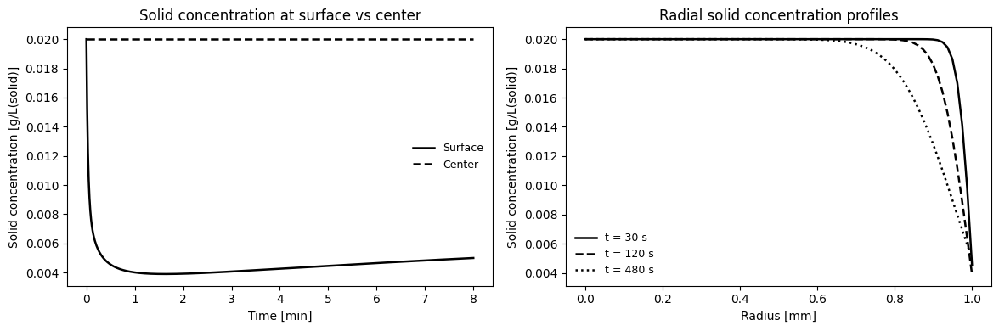
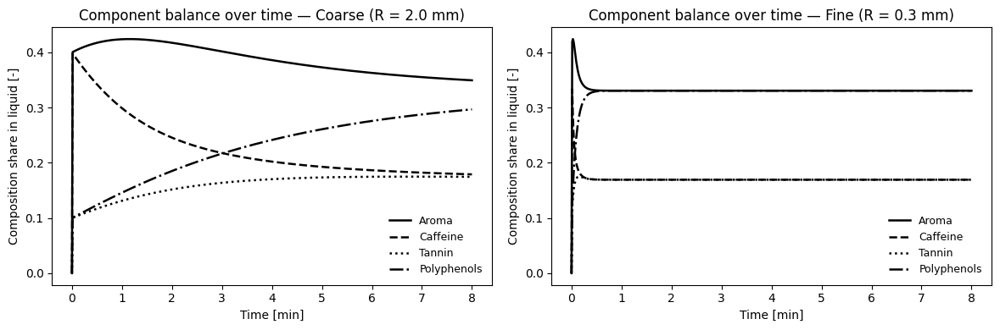
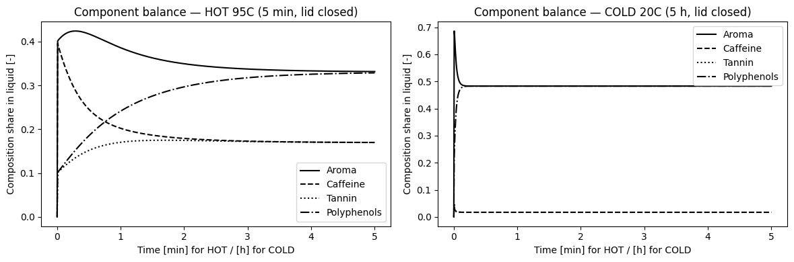
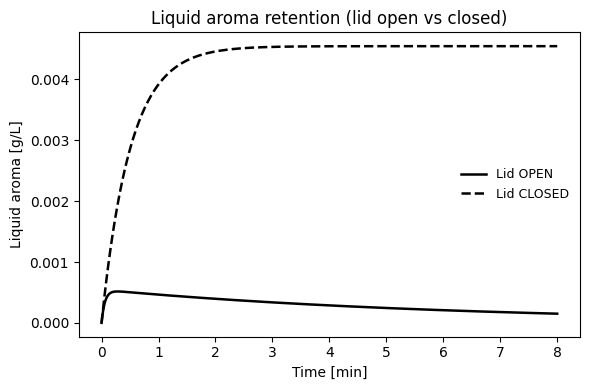

# 微分方程式的においしいお茶

きっと誰しも、美味しいお茶を飲みたいと思うことでしょう。

しかし、美味しいお茶を淹れるのはなかなか難しいものです。お茶の葉の量、お湯の温度、浸出時間など、様々な要素が絡み合って最終的な味わいが決まります。

身近なお茶の抽出も、分子の拡散という視点から見れば、時間とともに成分が移動する物理化学過程です。<br>
ここでは、微分方程式を用いてお茶の成分がどのように抽出されるかをモデル化し、美味しいお茶を淹れるための最適な条件を探ってみましょう。

## モデルの設定
お茶の成分が水に溶け出す過程を、以下のような球対称の拡散方程式で表現します。
$$
\frac{\partial c}{\partial t} = D\,\frac{1}{r^2}\frac{\partial}{\partial r}\!\left(r^2\,\frac{\partial c}{\partial r}\right)
$$
ここで、$c(r,t)$は位置$r$における時間$t$の成分濃度、$D$は拡散係数です。

茶葉は半径$R$の球としてモデル化し、茶葉の表面での成分濃度を$c_s$、初期状態での茶葉内部の成分濃度を$c_0$、お湯の初期成分濃度を$c_b$とします。

お茶には様々な成分が含まれています。今回はこれらの違いによる、味の変化を見てみたいと思います。

味や香りを特徴づける主要な成分を、拡散速度と温度依存性の観点から4つに代表させました。拡散の早いものと遅いもの、温水でよく溶けるものと溶解度の変化しないもの、の4種類を考えます。それぞれ、アロマ成分、カフェイン、タンニン、ポリフェノールと名付けました。
（今回のモデルでは、パラメータの違いが分かりやすいように設定しています。実際のパラメータとは異なる場合があります。）

||拡散|温水での溶解度|冷水への溶解度|
|--|--|--|--|
|アロマ|早い|◎|◎
|カフェイン|早い|〇|〇
|タンニン|遅い|〇|×
|ポリフェノール|遅い|◎|×

## シミュレーション結果
### アロマの抽出挙動

まず、単純に温水でのアロマ成分の抽出挙動を見てみましょう。

右図に示すように、表面は抽出されていますが、8分経過した段階でも内部はまだ濃度が高い状態です。
（実際の紅茶は5分程度するとあまり変わらないので、実際の拡散速度はもっと早いものと思います。）

面白いことに抽出が進むと、表面の濃度が一旦下がり、その後再び上昇しています。お湯の中のアロマ成分が増えてくるため茶葉の表面からの溶出が抑制される一方で、茶葉内部からの拡散が進むため表面濃度が再び上昇するのです。つまり、これは内部の濃度勾配が徐々に緩和し、内部から表面への拡散が支配的になるためと考えられます。




### 茶葉のサイズの影響

茶葉のサイズが抽出に与える影響も見てみましょう。紅茶の茶葉には、ダスト（非常に細かい茶葉）からオレンジ・ペコー（大きな茶葉）まで様々なサイズがあります。

最初に、オレンジ・ペコーの場合を見てみましょう。はじめに水によく溶けると設定したアロマとポリフェノールが早く抽出され、その後温水でよく溶けるカフェインとタンニンがゆっくりと抽出されていきます。また拡散の遅いポリフェノールは最初は多くを占めていましたが、他の成分が抽出されるにつれて相対的に減少していきます。

一方、ダストの場合は全ての成分が非常に早く抽出されます。茶葉が細かいことで表面積が増え、拡散距離も短くなるためです。そのため、最初に水によく溶ける成分が急速に抽出され、その後温水でよく溶ける成分もすぐに追いつきます。

このことから、茶葉のサイズはお茶の味わいに大きな影響を与えることがわかります。細かい茶葉を使うと、速やかに味が出ますが、渋み成分のタンニンも早く抽出されるため、苦味が強くなる可能性があります。一方、大きな茶葉を使うと、時間に応じて味わいが変化するため、好みに合わせた抽出が可能です。




### 温度の影響

次に温度の影響を見てみましょう。お茶の抽出は温度に大きく依存します。高温では成分の拡散が速くなり、溶解度も高くなるため、抽出が促進されます。一方、低温では拡散が遅くなり、溶解度も低下するため、抽出が抑制されます。

低温だと溶けにくいと設定したカフェインとタンニンの抽出が大幅に抑制されるため、最終的な液相中の成分濃度は非常に低くなります。一方、水によく溶けるアロマとポリフェノールはある程度抽出されます。




### ポットの蓋の開閉の影響

ここまでは蓋を閉めた状態での抽出を考えてきましたが、ポットの蓋も紅茶の香りに大きな影響を与えます。これまでは固体と液体の関係を考慮してきましたが、蓋の開閉を考えることで気相との平衡も取り入れられます。最後に、蓋の開閉がアロマ成分の抽出に与える影響を見てみましょう。

蓋を閉めた状態では、アロマが逃げないため、香り高い紅茶が楽しめます。一方、蓋を開けた状態では、アロマが蒸発しやすくなり、香りが弱くなる可能性があります。

アロマについて気液平衡を考慮し、蓋を開けることを気相の一部を交換することでモデル化しました。蓋を開けた場合、アロマ成分の液相濃度が低下し、その結果、茶葉からの抽出が促進されます。しかし、同時にアロマ成分が気相に逃げてしまうため、最終的な液相中のアロマ濃度は蓋を閉めた場合よりも低くなります。




## まとめ

微分方程式を用いてお茶の成分抽出をモデル化することで、茶葉のサイズ、ポットの蓋の開閉、温度などが抽出挙動に与える影響を理解することができました。これらの要素を適切に調整することで、自分好みの美味しいお茶を淹れることが可能です。
- 茶葉のサイズは抽出速度と味わいに大きな影響を与える。
- 温度は成分の拡散と溶解度に影響し、抽出効率を左右する。
- ポットの蓋を閉めることでアロマ成分の損失を防げる。

夏の水出し紅茶のスッキリした味わいが溶解度の温度依存性によって説明できることや、茶葉の細かさが味に与える影響など、日常生活での経験と科学的理解が結びつく興味深い例となりました。

このように、科学的理解は美味しさの再現性を高める手段となります。これらの知見を活用して、ぜひ自分だけの美味しいお茶を楽しんでください。

また、以下のソースコードを基にして、様々な条件でのシミュレーションを試みることもできます。
```python
import numpy as np
import pandas as pd
import matplotlib.pyplot as plt
from math import pi
from dataclasses import dataclass
from scipy.integrate import solve_ivp
from IPython.display import display
from math import log

# ---------------- Parameters ----------------
@dataclass
class Params:
    R: float = 1.0e-3        # particle radius [m]
    D: float = 2.0e-10       # solid diffusivity [m^2/s]
    kf: float = 5.0e-5       # liquid-side mass transfer [m/s]
    K: float = 2.0           # partition parameter [-]
    V_liq_L: float = 0.200   # liquid volume [L]
    Np: int = 2000           # number of particles
    c_s0: float = 20.0       # initial solid conc [g/m^3(solid)]
    c0: float = 0.0          # initial bulk [g/L]
    m_s: float = 2.0         # Solid mass [g]
    Vg: float = 2.0e-4       # Headspace volume [m^3] ~ 200 mL

P = Params()

# ---------------- Model ----------------
# Components: Aroma (fast, temp-independent), Caffeine (fast, temp-dependent),
# Tannin (slow, temp-dependent), Polyphenols (slow, temp-dependent)
components = {
    "Aroma":       {"M":0.020, "K":2.0,  "D":2.0e-10, "dH_K":-8e3,  "Ea":15e3},
    "Caffeine":    {"M":0.020, "K":4.0,  "D":2.0e-10, "dH_K":-8e3,  "Ea":15e3},
    "Tannin":      {"M":0.020, "K":4.0,  "D":0.5e-10, "dH_K":-40e3, "Ea":15e3},
    "Polyphenols": {"M":0.020, "K":2.0,  "D":0.5e-10, "dH_K":-40e3, "Ea":15e3},
}

R_g = 8.314  # J/mol/K

# LDF coefficient
def k_ldf(R, D): return 15.0 * D / (R**2)

# Temperature dependence functions
T_ref = 368.15  # 95 C
def D_of_T(D_ref, Ea, T, Tref=T_ref): return D_ref * np.exp(-Ea/R_g * (1.0/T - 1.0/Tref))
def K_of_T(K_ref, dH, T, Tref=T_ref): return K_ref * np.exp(-dH/R_g * (1.0/T - 1.0/Tref))
def H_of_T(H_ref, dH, T, Tref=T_ref): return H_ref * np.exp(+dH/R_g * (1.0/T - 1.0/Tref))

def build_rhs(T= T_ref):
    # Liquid concentrations (c_L, c_A) are expressed in g/L (grams per liter of liquid phase).
    # Solid-phase concentrations (c_sL, c_sA) are expressed in g/m^3(grams per cubic meter of solid).
    Ks = {key: K_of_T(c["K"], c["dH_K"], T) for key, c in components.items()}
    Ds = {key: D_of_T(c["D"], c["Ea"], T)   for key, c in components.items()}
    kLDFs = {n: k_ldf(P.R, Ds[n]) for n in Ds.keys()}
    H_A = H_of_T(1.0e-3, 18e3, T)
    
    def rhs(t, y, kLa, Q):
        qA, cA, qC, cC, qT, cT, qP, cP, yA = y

        # LDF terms (no gas)
        # precompute kLDFs and K
        dqA = -kLDFs["Aroma"]       * (qA - Ks["Aroma"]      * cA)
        dqC = -kLDFs["Caffeine"]    * (qC - Ks["Caffeine"]    * cC)
        dqT = -kLDFs["Tannin"]      * (qT - Ks["Tannin"]      * cT)
        dqP = -kLDFs["Polyphenols"] * (qP - Ks["Polyphenols"] * cP)

        # Aroma gas coupling
        J_ag = kLa * (cA / H_A - yA)            # [pressure-equivalent units / s]
        dcA = ( -P.m_s * dqA / P.V_liq_L ) - J_ag         # [g/L/s]  minus gas stripping
        dyA = ( kLa * P.V_liq_L / P.Vg ) * (cA / H_A - yA) - ( Q * yA / P.Vg ) 

        # Others: no gas route
        dcC = ( -P.m_s * dqC / P.V_liq_L )
        dcT = ( -P.m_s * dqT / P.V_liq_L )
        dcP = ( -P.m_s * dqP / P.V_liq_L )

        return np.array([dqA, dcA, dqC, dcC, dqT, dcT, dqP, dcP, dyA], dtype=float)
    return rhs

def linestyle_generator():
    for r in ["-", "--", ":", "-."]: yield r
    
def apply_bw_style(linewidth=1.8, markersize=6, fontsize=10):
    from cycler import cycler
    style = {
        "lines.linewidth": linewidth,
        "lines.markersize": markersize,
        "font.size": fontsize,
        "axes.prop_cycle": cycler("color", ["0.0","0.25","0.5","0.75"]),
        "axes.facecolor": "white",
    }
    return style

def plot_timeseries_bw(x, ys, labels, linestyles=None, markers=None,
                       xlabel="", ylabel="", title="", figsize=(6,4), loc="best"):
    import matplotlib.pyplot as plt
    import matplotlib as mpl
    style = apply_bw_style()
    with mpl.rc_context(style):
        plt.figure(figsize=figsize)
        n = len(ys)
        if linestyles is None:
            linestyles = ["-", "--", ":", "-."] * ((n//4)+1)
        markevery = max(1, len(x)//20)
        for i in range(n):
            plt.plot(x, ys[i],
                    color="k",
                    linestyle=linestyles[i],
                    markevery=markevery,
                    label=labels[i])
        plt.xlabel(xlabel); plt.ylabel(ylabel)
        plt.title(title)
        plt.legend(frameon=False, loc=loc, fontsize=9)
        plt.tight_layout()
        plt.show()
```

```Python
# Geometry
A_p = 4.0 * pi * P.R**2
A_total = P.Np * A_p
V_liq_m3 = P.V_liq_L / 1000.0

# Radial grid (cell-centered finite volume)
M = 80
r_nodes = np.linspace(0.0, P.R, M)          # cell centers
dr = r_nodes[1] - r_nodes[0]
r_face_left  = np.concatenate(([0.0], (r_nodes[:-1] + r_nodes[1:]) / 2.0))   # r_{i-1/2}
r_face_right = np.concatenate(((r_nodes[:-1] + r_nodes[1:]) / 2.0, [P.R]))   # r_{i+1/2}
vol_shell = (4.0/3.0) * pi * (r_face_right**3 - r_face_left**3)              # volumes of shells

def rhs(t, y, P: Params):
    c_s = y[:-1].copy()    # [g/m^3(solid)]
    cL_m3 = y[-1] * 1000.0

    # --- Fluxes at faces ---
    # Left face (center): symmetry -> zero gradient -> flux = 0
    F_left = np.zeros(M)  # will store flux at left face of each cell
    # Internal faces: gradient between neighboring cells
    grad_internal = (c_s[1:] - c_s[:-1]) / dr
    # Flux at internal faces j = 1..M-1 corresponds to right face of cell j-1 and left face of cell j
    F_face = -P.D * ( ((r_nodes[:-1] + r_nodes[1:]) / 2.0)**2 ) * grad_internal  # size M-1

    # Assign to left/right arrays
    F_right = np.zeros(M)
    F_right[:-1] = F_face            # right face of cell i (i=0..M-2)
    F_left[1:]   = F_face            # left face of cell i (i=1..M-1)

    # Rightmost boundary (r=R): Robin -> flux equals film mass transfer (positive out of solid)
    # Sign convention: F = -D r^2 dc/dr. Solid mass rate in cell = (F_left - F_right)/vol.
    # At outer boundary, set F_right for last cell to: F_R = + r_R^2 * kf * (c_surf/K - cL_m3)
    c_surf = c_s[-1]
    F_right[-1] = (P.R**2) * P.kf * (c_surf / P.K - cL_m3)

    # Solid PDE (finite volume)
    dc_s_dt = (F_left - F_right) / vol_shell

    # Liquid ODE
    J = P.kf * (c_surf / P.K - cL_m3)              # [g m^-3 s^-1] per area
    dc_dt = (A_total / V_liq_m3) * J / 1000.0      # [g L^-1 s^-1]

    dydt = np.zeros_like(y)
    dydt[:-1] = dc_s_dt
    dydt[-1] = dc_dt
    return dydt

# Initial conditions
y0 = np.zeros(M+1)
y0[:-1] = P.c_s0
y0[-1] = P.c0

# Solve
t_span = (0.0, 8*60.0)  # 8 minutes
t_eval = np.linspace(*t_span, 500)
sol = solve_ivp(rhs, t_span, y0, args=(P,), method="Radau", t_eval=t_eval, rtol=1e-6, atol=1e-9)
if not sol.success:
    raise RuntimeError(sol.message)

# Prepare outputs
cL = sol.y[-1, :]
c_center = sol.y[0, :]
c_surface = sol.y[-2, :]

df = pd.DataFrame({
    "time_s": sol.t,
    "c_bulk_g_per_L": cL,
    "c_surface_g_per_m3": c_surface,
    "c_center_g_per_m3": c_center,
})
display(df.head(20))

csv_path = "./fick_dimensional_timeseries.csv"
df.to_csv(csv_path, index=False)

# Plots
plot_timeseries_bw(sol.t/60.0,
                  [cL],
                  ["Bulk"],
                  xlabel="Time [min]",
                  ylabel="Bulk concentration [g/L]",
                  title="Bulk liquid concentration (Fick model)")


plot_timeseries_bw(sol.t/60.0,
                  [c_surface/1000, c_center/1000],
                  ["Surface", "Center"],
                  xlabel="Time [min]",
                  ylabel="Solid concentration [g/L(solid)]",
                  title="Solid concentration at surface vs center")


# Radial profiles at selected times
times_pick = [30.0, 120.0, 480.0]  # seconds

plot_timeseries_bw(r_nodes*1e3,
                  [sol.y[:-1, np.argmin(np.abs(sol.t - tp))]/1000 for tp in times_pick],
                  [f"t = {tp:.0f} s" for tp in times_pick],
                  xlabel="Radius [mm]",
                  ylabel="Solid concentration [g/L(solid)]",
                  title="Radial solid concentration profiles")
```

```Python
# Particle radii [m] to compare
sizes = {
    "Fine (R = 0.3 mm)": 0.0003,
    "Medium (R = 1.0 mm)": 0.0010,
    "Coarse (R = 2.0 mm)": 0.0020,
}

# Time grid
t = np.linspace(0, 8*60, 600)  # 0–8 min in seconds

# ---------------- LDF ODE (analytical solution) ----------------

def solution_for_component(M, K, kLDF):
    # Closed-form with c0=0 and q0 = M/P.m_s
    q0 = M / P.m_s
    tau = 1.0 / (kLDF * (1.0 + K * P.m_s / P.V_liq_L))
    c_eq = M / (P.V_liq_L + P.m_s * K)
    c_t = c_eq - (P.m_s / (P.V_liq_L + P.m_s * K)) * q0 * np.exp(-t / tau)
    return c_t, c_eq, tau

# ---------------- Simulations ----------------
rows_summary = []
rows_timeseries = []

for size_label, R in sizes.items():
    # Compute per-component time series and totals
    c_mat = []
    comp_summ = []
    for key, comp in components.items():
        c_t, c_eq, tau = solution_for_component(comp["M"], comp["K"], k_ldf(R, comp["D"]))
        c_mat.append(c_t)
        comp_summ.append({"name": key, "c_eq": c_eq, "tau": tau, "t90_min": tau*log(10)/60.0})
        rows_summary.append({
            "Size": size_label,
            "Component": key,
            "R_mm": R*1e3,
            "K": comp["K"],
            "D_m2s": comp["D"],
            "tau_s": tau,
            "t90_min": tau*log(10)/60.0,
            "c_eq_gL": c_eq
        })
    c_mat = np.vstack(c_mat)  # shape [n_comp, len(t)]
    c_total = np.sum(c_mat, axis=0)
    # Composition shares
    shares = c_mat / (c_total + 1e-12)
    # Save time series
    for j, tj in enumerate(t):
        row = {"Size": size_label, "time_s": float(tj), "c_total_gL": float(c_total[j])}
        for i, name in enumerate(list(components.keys())):
            row[f"c_{name}_gL"] = float(c_mat[i, j])
            row[f"share_{name}"] = float(shares[i, j])
        rows_timeseries.append(row)

# DataFrames
df_summary = pd.DataFrame(rows_summary)
df_ts = pd.DataFrame(rows_timeseries)

# Show head tables
display(df_summary)
display(df_ts.head(20))

# Save CSVs
csv_summary = "./multicomponent_size_summary.csv"
csv_ts = "./multicomponent_size_timeseries.csv"
df_summary.to_csv(csv_summary, index=False)
df_ts.to_csv(csv_ts, index=False)

# ---------------- Plots ----------------
# 1) Total concentration vs time for each size
plot_timeseries_bw(df_ts[df_ts["Size"] == "Fine (R = 0.3 mm)"]["time_s"]/60.0,
                  [df_ts[df_ts["Size"] == size_label]["c_total_gL"] for size_label in sizes.keys()],
                  list(sizes.keys()),
                  xlabel="Time [min]",
                  ylabel="Total concentration [g/L]",
                  title="Total extraction vs time (size effect)")

# 2) Per-component concentration vs time (overlay sizes)
for name in list(components.keys()):
    plot_timeseries_bw(df_ts[df_ts["Size"] == size_label]["time_s"]/60.0,
                      [df_ts[df_ts["Size"] == size_label][f"c_{name}_gL"] for size_label in sizes.keys()],
                      list(sizes.keys()),
                      xlabel="Time [min]",
                      ylabel=f"{name} concentration [g/L]",
                      title=f"{name} extraction vs time (size effect)")

# 3) Composition shares over time (stack-like lines): show Fine vs Coarse
for size_label in ["Fine (R = 0.3 mm)", "Coarse (R = 2.0 mm)"]:
    plot_timeseries_bw(df_ts[df_ts["Size"] == size_label]["time_s"]/60.0,
                      [df_ts[df_ts["Size"] == size_label][f"share_{name}"] for name in components.keys()],
                      list(components.keys()),
                      xlabel="Time [min]",
                      ylabel="Composition share in liquid [-]",
                      title=f"Component balance over time — {size_label}"
    )
```
```Python
# Scenarios for kLa (1/s) and ventilation Q (m^3/s)
scenarios = {
    "Lid OPEN":   {"kLa": 0.05, "Q": 1.0e-4},
    "Lid CLOSED": {"kLa": 0.02, "Q": 0.0},
}

t_span = (0.0, 8*60.0)     # 8 minutes [s]
t_eval = np.linspace(*t_span, 600)

# Initial state
y0 = []
for c in components.values(): y0 += [c["M"]/P.m_s, 0.0]  # q0 = M/P.m_s, c0 = 0
y0 += [0.0]  # yA(0)=0
y0 = np.array(y0, dtype=float)

# Solve scenarios
records_summary = []
dfs = {}

for label, sc in scenarios.items():
    sol = solve_ivp(build_rhs(368.15), t_span, y0, args=(sc["kLa"], sc["Q"]), method="Radau", t_eval=t_eval, rtol=1e-7, atol=1e-9)
    if not sol.success:
        raise RuntimeError(f"ODE failed: {sol.message}")
    # build dataframe
    data = {"time_s": sol.t}
    idx = 0
    for nm in components.keys():
        data[f"q_{nm}"] = sol.y[idx, :]; idx += 1
        data[f"c_{nm}_gL"] = sol.y[idx, :]; idx += 1
    data["yA"] = sol.y[idx, :]
    df = pd.DataFrame(data)
    # Metrics
    df["c_total_gL"] = df[[f"c_{nm}_gL" for nm in components.keys()]].sum(axis=1)
    for nm in components.keys():
        df[f"share_{nm}"] = df[f"c_{nm}_gL"] / (df["c_total_gL"] + 1e-12)
    dfs[label] = df

    # snapshot summary after 4 min and 8 min
    for t_pick in [240.0, 480.0]:
        j = np.argmin(np.abs(df["time_s"] - t_pick))
        records_summary.append({
            "Scenario": label, "time_s": float(df["time_s"].iloc[j]),
            "cA_gL": float(df["c_Aroma_gL"].iloc[j]),
            "c_total_gL": float(df["c_total_gL"].iloc[j]),
            "share_Aroma": float(df["share_Aroma"].iloc[j]),
            "yA_headspace": float(df["yA"].iloc[j])
        })

df_summary = pd.DataFrame(records_summary)
display(df_summary)

# Save CSVs
for label, df in dfs.items():
    path = f"./ode_aroma_gas_{label.replace(' ', '_').lower()}.csv"
    df.to_csv(path, index=False)

# ---------------- Plots ----------------
# 1) Liquid aroma vs time
plot_timeseries_bw(dfs[label]["time_s"]/60.0,
                  [dfs[label]["c_Aroma_gL"] for label in dfs.keys()],
                  list(dfs.keys()),
                  linestyles=["-", "--"],
                  xlabel="Time [min]",
                  ylabel="Liquid aroma [g/L]",
                  title="Liquid aroma retention (lid open vs closed)")

# 2) Headspace signal (aroma)
plot_timeseries_bw(dfs[label]["time_s"]/60.0,
                  [dfs[label]["yA"] for label in dfs.keys()],
                  list(dfs.keys()),
                  linestyles=["-", "--"],
                  xlabel="Time [min]",
                  ylabel="Headspace aroma (relative) [-]",
                  title="Headspace aroma build-up")

# 3) Total concentration (taste strength proxy)
plot_timeseries_bw(dfs[label]["time_s"]/60.0,
                  [dfs[label]["c_total_gL"] for label in dfs.keys()],
                  list(dfs.keys()),
                  linestyles=["-", "--"],
                  xlabel="Time [min]",
                  ylabel="Total concentration [g/L]",
                  title="Total extraction vs time")
```
```Python
scenarios = {
    "HOT 95C (5 min, lid closed)": {"T": 368.15, "t_span": (0.0, 5*60.0), "t_eval": np.linspace(0, 5*60.0, 600)},
    "COLD 20C (5 h, lid closed)": {"T": 293.15, "t_span": (0.0, 5*3600.0), "t_eval": np.linspace(0, 5*3600.0, 800)},
}

# Initial state
y0 = []
for c in components.values(): y0 += [c["M"]/P.m_s, 0.0]  # q0 = M/P.m_s, c0 = 0
y0 += [0.0]  # yA
y0 = np.array(y0, dtype=float)

# Solve scenarios
dfs = {}

for label, sc in scenarios.items():
    sol = solve_ivp(build_rhs(sc["T"]), sc["t_span"], y0,args=(0,0), method="Radau", t_eval=sc["t_eval"], rtol=1e-7, atol=1e-9)
    if not sol.success:
        raise RuntimeError(sol.message)
    data = {"time_s": sol.t}
    idx = 0
    for c in components.keys():
        data[f"q_{c}"] = sol.y[idx, :]; idx += 1
        data[f"c_{c}_gL"] = sol.y[idx, :]; idx += 1
    data["yA"] = sol.y[idx, :]
    df = pd.DataFrame(data)
    # Metrics
    df["c_total_gL"] = df[[f"c_{c}_gL" for c in components.keys()]].sum(axis=1)
    for c in components.keys():
        df[f"E_{c}"] = (P.V_liq_L * df[f"c_{c}_gL"]) / components[c]["M"]
    df["E_total_mass_g"] = P.V_liq_L * df["c_total_gL"]
    for c in components.keys():
        df[f"share_{c}"] = df[f"c_{c}_gL"] / (df["c_total_gL"] + 1e-12)
    dfs[label] = df
    # Save
    path = f"./ode_hot_cold_fixed_{label.split()[0].lower()}.csv"
    df.to_csv(path, index=False)
    print(label, "->", path)

# Snapshot table at comparable "serving" times (hot: 4 & 8 min; cold: 2 & 8 h)
snap_rows = []
for label, df in dfs.items():
    times_pick = [240.0, 480.0] if "HOT" in label else [2*3600.0, 8*3600.0]
    for tp in times_pick:
        j = np.argmin(np.abs(df["time_s"] - tp))
        row = {"Scenario": label, "time_label": f"{tp/60:.0f} min" if "HOT" in label else f"{tp/3600:.0f} h",
               "total_mass_g": float(df["E_total_mass_g"].iloc[j])}
        for c in components.keys():
            row[f"E_{c}"] = float(df[f"E_{c}"].iloc[j])
            row[f"share_{c}"] = float(df[f"share_{c}"].iloc[j])
        snap_rows.append(row)
snap_df = pd.DataFrame(snap_rows)
display(snap_df)

# ---------------- Plots ----------------
# 1) Total dissolved mass vs time
linestyle = linestyle_generator()
plt.figure(figsize=(6,4))
for label, df in dfs.items():
    x = df["time_s"]/60.0 if "HOT" in label else df["time_s"]/3600.0
    plt.plot(x, df["E_total_mass_g"], label=label, linestyle=next(linestyle), color="k")
plt.xlabel("Time [min] for HOT / [h] for COLD")
plt.ylabel("Total dissolved mass [g]")
plt.title("Total dissolved mass in liquid")
plt.legend()
plt.tight_layout()
plt.show()

# 2) Per-component extraction fractions
for c in components.keys():
    linestyle = linestyle_generator()
    plt.figure(figsize=(6,4))
    for label, df in dfs.items():
        x = df["time_s"]/60.0 if "HOT" in label else df["time_s"]/3600.0
        plt.plot(x, df[f"E_{c}"], label=label, linestyle=next(linestyle), color="k")
    plt.xlabel("Time [min] for HOT / [h] for COLD")
    plt.ylabel(f"Extraction fraction {c} [-]")
    plt.title(f"{c} extraction fraction vs time")
    plt.legend()
    plt.tight_layout()
    plt.show()

# 3) Composition shares (liquid) over time
for label, df in dfs.items():
    linestyle = linestyle_generator()
    plt.figure(figsize=(6,4))
    x = df["time_s"]/60.0 if "HOT" in label else df["time_s"]/3600.0
    for c in components.keys():
        plt.plot(x, df[f"share_{c}"], label=c, linestyle=next(linestyle), color="k")
    plt.xlabel("Time [min] for HOT / [h] for COLD")
    plt.ylabel("Composition share in liquid [-]")
    plt.title(f"Component balance — {label}")
    plt.legend()
    plt.tight_layout()
    plt.show()
```